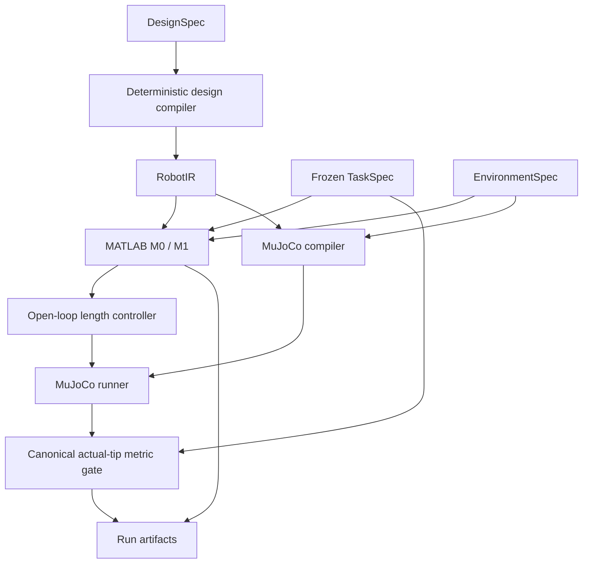

# 统一机器人智能设计开发平台

## 当前开发入口

真实机器人链路从 [结构候选、统一信号与保存数据诊断](docs/platform_domain.md) 开始：复用现有等效杆编译、MATLAB／MuJoCo 和原诊断工具；内含可复制命令、开放参数及领域原子／内部库／教学示例分类。

从 [平台架构与操作](docs/platform.md) 开始，推荐命令为 `python examples/workbench.py platform ...`；它转发到 `examples/development_platform.py` 的同一实现。新增扩展先读 [扩展指南与最小模板](docs/platform_extensions.md)，协作分工见 [共同核心与包作者责任](docs/platform_parallel_development.md)，任务配置见 [填写指南](docs/platform_tasks.md)。

```powershell
conda activate softagent
python examples/workbench.py platform catalog
python examples/workbench.py platform check configs/platform/signal_hold/session.yaml
```

接口以源码及其 [生成契约](docs/platform_generated/contracts.json)、[生成目录](docs/platform_generated/catalog.md) 为准，生成命令为 `python examples/export_platform_contracts.py`。版本独立：ToolReceipt／EvaluationResult 默认 1.2.0（含原始执行来源），WorkerOutput 为 2.0.0；不能当作所有工具的版本，详见 [接口决策](docs/platform_interface_decisions.md)。

`extensions/reference` 和 `extensions/convergence` 提供可执行接口参考，其中合成后端不代表真实机器人能力。模板的 `*_skeleton.py`、`backend.genesis` 等仍待实现；“实现未提供”和“当前环境缺依赖”是不同状态，目录也不代表运行授权或物理验收。现有 MuJoCo／MATLAB 兼容适配的范围见 [后端说明](docs/platform_extensions.md#后端能力与资源)。

## 兼容入口与历史实验记录

以下框架／公共工具旧入口和逐轮实验材料保留原实现、授权边界及当时结论；不是新扩展的当前接口规范。历史版本、环境状态、全测和实验命令只描述对应轮次，不作为本轮开发步骤。当前验收与历史记录的分界见 [验证说明](docs/platform_validation.md)。

框架扩展机制已落地：[七项边界、迁移与接入路线](docs/framework_extensions.md)、[验证记录](docs/framework_validation.md)。工具版本为 1.1.0；历史说明与证据保留。

公共工具接口 v1 已接入：[统一工具清单](docs/public_tools_catalog.md)、[调用规范与迁移/扩展路线](docs/public_tools.md)、[验证记录](docs/public_tools_validation.md)。使用 `python examples/public_tools.py catalog` 发现带命名空间的工具；旧工作台和动力学命令继续有效。以下逐轮说明保留为历史记录。

第九轮已运行独立 MATLAB 多关节动力学、逐次计费的连续参数搜索、MuJoCo 验证与 C2 对照。当前 `runs/round9_reach` 的最佳 c066 在原 reach_free 任务中误差 **0.0001043346913 m（0.1043 mm）**，最大拉力仍为 20 N。
真实数值运行：MATLAB 动态 69 次（含 1 次超时）、其他 MATLAB 数学调用 76 次、MuJoCo 6 次；**本轮 DeepSeek API 调用为 0，当前进程及 Windows 环境均未配置密钥，外部 LLM 闭环验收尚未完成**。详见[结果与限制](docs/round9_result.md)、[实际操作命令](docs/round9_usage.md)。
查看工作台：`runs/round9_reach/index.html`；继续单模型会话：`python examples/workbench.py dynamics resume --root runs/round9_reach`。该命令不会增加授权额度。第九轮仅使用聚焦检查，不运行下文历史 full-suite 命令。

第八轮已增加持续工作记忆、完整诊断入口、默认开启思考模式、独立新增预算和 MuJoCo 原生场景回放，见[操作与实际结果](docs/round8_design.md)。
第九轮审计实际文件确认：`runs/round8_ready` 已停止于预算约束，累计 28 次真实模型请求，Round 8 新增 10/12；已有 c000/c001/c002 三个真实评价，最佳误差 0.1164444630 m。
`python examples/workbench.py resume runs/round8_ready` 继续模型；`python examples/native_replay.py runs/round8_ready` 打开原生保存轨迹窗口。
旧文档中的 WAITING_FOR_KEY 是打包时记录，不代表之后实际运行的状态；历史文件与 Round 8 账本保留不变。

第七轮已完善有限上下文、按需证据读取、思考协议和兼容续接，见[中文操作说明](docs/round7_continuation.md)和[实际结果](docs/round7_result.md)。
当前 `runs/round7_ready` 继承第六轮七次真实模型请求、两个已评价候选和两次仿真；已有比较、动画和曲线。本轮进程无密钥，新增真实模型请求与仿真均为零。
设置 `DEEPSEEK_API_KEY` 后运行 `python examples/workbench.py resume runs/round7_ready`；剩余最多一个候选、一次仿真和十一次模型请求。
`python examples/workbench.py observe runs/round7_ready` 打开中文观察页。机器人尚未达到一厘米精度，模型续接收尾等待密钥。

第六轮接入说明和当时交付记录保留在[使用说明](docs/round6_deepseek.md)和[历史结果](docs/round6_result.md)；本轮以随后实际运行的 `runs/round6_ready` 为准。

第五轮统一入口见[中文工作台说明](docs/round5_workbench.md)及[验证结果](docs/round5_result.md)。
`python examples/workbench.py run` 创建最多一次新仿真的固定规则闭环；
`python examples/workbench.py observe runs/workbench_demo` 打开中文观察服务。
第五轮的零仿真历史闭环使用 `python examples/workbench.py observe runs/round5_replay_complete`；
该轮 MATLAB 启动失败记录保持不变，第六轮已另行恢复真实计算。
已有实验使用 `resume` 继续或直接观察，不能通过重复 `run` 覆盖。
本轮只运行 `python -m unittest tests.test_workbench -v` 等改动相关检查；
下方第三、第四轮全量测试与实验命令仅是历史说明，不适用于第五轮验证。

第四轮现提供[动态观察入口与中文说明](docs/round4_observation.md)、
[六类能力和任务接口](docs/round4_workbench.md)、[模型限制来源表](docs/round4_model_limits.md)
及[本轮结果与预算](docs/round4_result.md)。打开保存运行：
`python examples/observe.py runs/round4/length/0.30623771682/C1 runs/round4/length/0.30623771682/C2`。
观看与导出动画不启动新仿真；本轮长度对照已结束，不要为查看结果重新运行实验。

The historical closeout implements a persistent bounded campaign with fixed C1/C2 pairs,
normal trajectories, independent MATLAB reduced mechanics and offline evidence audit.
See [closeout entry and capability matrix](docs/round3_closeout_tools.md),
[validation](docs/round3_closeout_validation.md) and [research result](docs/round3_deterministic_closeout_result.md).
The [V1 design envelope](docs/design_envelope.md) remains authoritative; the
[closeout authorization](configs/experiments/round3_closeout_authorization.yaml) adds
only this session's fixed C2 and independent surrogate analysis permissions.
The [Round 3 FINAL report](docs/round3_final_result.md) and its artifacts are historical,
immutable evidence. Do not rerun its five studies to validate the closeout.

Round 3.1 adds optional `--debug` and `--visualize` observability and a Human-approved,
file-scoped total-length experiment for reach_free. See [debug usage](docs/debug_visualization.md)
and [Round 3.1 results](docs/round3_1_result.md). The Round 3 authorization status
below is historical; permissions outside the envelope/closeout scope remain restricted.

Round 3 adds policy-authorized deterministic multi-fidelity candidate evaluation,
bounded design search, PCC tip feedback, sensitivity evidence and a bounded repair
loop. These capabilities are implemented; executable experiment authority is checked
against each policy and its scoped approval. Frozen benchmark truth is unchanged. See [execution/authority contracts](docs/round3_experiments.md)
and [required Human decisions](proposals/engineer/round3_human_decisions.md).

The deterministic entry runs the tendon-driven continuum V1 research pipeline;
Round 6 adds an optional single-model DeepSeek decision loop. Both preserve the
main@245a785 kinematic and low-fidelity segmented
MuJoCo surrogate behavior. TASK_FAILED is a valid, recorded scientific outcome.
There is no physical calibration, RL, Cosserat, FEM or validated material model.

## Run and test

Use the existing Python environment with Pydantic 2, PyYAML, MuJoCo and a MATLAB
Engine installation matching local MATLAB. No new agent framework is required.
In the current Windows setup:

```powershell
conda activate softagent
python examples/run_reach_pipeline.py
$env:SOFTROBOT_TEST_MATLAB = "1"
python -m unittest discover -s tests -v
```

Enable real MATLAB before the single full regression. For this closeout use
`python examples/validate_closeout.py full-suite`, which records and enforces the
one-full-suite allowance. Temporary test runs live under runs/ and are cleaned up.
MATLAB requires a working licensed local installation and process-launch access.
Python's Expat is still loaded before MATLAB DLLs on Windows.

The example prints a unique runs/<id>/ directory. Exit 0 means task PASS; exit 1
means recorded task/model/capability failure or runtime error. Read run.json and
trace.json first; trace.jsonl provides the detailed execution timeline. Missing downstream data is omitted, never fabricated. The
baseline target remains [0.25,0,0.15] m with tolerance 0.01 m. Baseline PCC error
is 0.08714456960728613 m and actual MuJoCo error is 0.17116166894090315 m, hence
TASK_FAILED. The migration reproduces these values (MuJoCo 3.13.0).

## Source-of-truth map

| Layer | Authoritative source / representation |
| --- | --- |
| Task and success threshold | tasks/reach_free/task.yaml |
| Environment geometry, frame, gravity | tasks/reach_free/environment.yaml |
| Frozen MuJoCo environment representation | tasks/reach_free/mujoco.xml, validated against EnvironmentSpec |
| Benchmark membership and evaluator | benchmarks/tendon_v1.yaml |
| High-level design | configs/design_tendon_arm.yaml; schemas/design_spec.py; approved grammar.yaml |
| Resolved robot structure | schemas/robot_ir.py + tools/design_compiler.py; each run saves robot_ir.yaml |
| Physics and actuator assumptions | physics_contracts/*.md; values in legacy_v1_surrogate.yaml |
| Controller | schemas/control_spec.py, controllers/base.py, controllers/open_loop_length.py; run controller.json |
| Simulator numerical settings | configs/simulator.yaml; other engine defaults identified by recorded version |
| Run duration and seed | configs/run.yaml |
| Canonical metrics | metrics/reach.py, with tolerance from TaskSpec |
| Tool implementation / roadmap | capabilities/tools/*/manifest.yaml |
| Agent permissions and outputs | agents/contracts/; agents/*/ROLE.md |
| Factual evidence | runs/<id>/ snapshots, results, state, trace, hashes and versions |
| Memory | Future historical index; schemas/memory.py contract only |
| Skill | skills/ versioned strategies, evidence and Human admission; initially empty |



MATLAB validates the same environment frame/identity but M0/M1 omit gravity and
contact; those fields are not silently modeled. RobotIR provides shared length,
routing angles/offsets and surrogate fields; model-specific omissions are explicit.

## Gates and authority

Spec gate validates schemas and frozen environment representation. Design/grammar
gate checks deterministic capability support. Physics sanity checks model loading
and finite qpos/qvel/final tip; this is not a physical validation certificate.
Task metric gate applies final Euclidean error <= frozen tolerance to the actual
MuJoCo tip. A finite PCC plan may pass with model_task_success=false. Diagnosis
can explain a failure but cannot change these decisions.

Human owns tasks, benchmarks, scientific schemas, grammar, contracts and canonical
metrics. Engineer proposes routes/designs; Coding implements approved capabilities;
Diagnosis reports evidence-based hypotheses. See agents/contracts/README.md for
permissions and limits. The tested permission helper is a future executor contract,
not OS sandboxing; no LLM runtime or autonomous writer is implemented here.

## Migration and recovery

The old example command remains valid and now calls tools.harness.run_reach.
configs/task_reach.yaml stays as a deprecated compatibility copy: load_task checks
it against the frozen task. configs/design_tendon_arm.yaml is unchanged. The legacy
mujoco/environments/reach_free.xml stays as a tested reference but is not a second
executable source. compile_mujoco and MATLAB adapters accept DesignSpec for old
callers and compile it through the shared RobotIR compiler; the Harness builds
one IR and passes it to both. validate_task delegates to run_task with the C1
controller (or C0 passive when no command is supplied). matlab_analysis remains
a registry alias for the model bundle. Raw legacy failure codes are retained;
schemas/failure_taxonomy.py supplies a separate top-level category mapping.

Each run saves task/environment/design snapshots, robot IR, available model/command/
controller/MuJoCo results, generated robot.xml, final qpos/qvel, separate model and
MuJoCo metrics, and a gate trace. run.json records UTC timestamp, git commit/dirty
state, Python/MATLAB/MuJoCo versions, model/control levels, seed, final status and
SHA-256 hashes of exact artifact bytes. runtime.json records dependency versions.
source_snapshot.zip preserves current source/contracts/settings even with uncommitted
changes. Hashes detect changes; they are not a cryptographic signature against a
writer who can replace the whole run.

To inspect/reproduce the MuJoCo stage, verify hashes, load saved task.yaml and
controller.json, then call run_task on saved robot.xml with saved run_settings.yaml
in the recorded MuJoCo version. MATLAB regeneration additionally requires the
recorded MATLAB version, source snapshot and license. External runtimes themselves
are not bundled, and bitwise reproducibility across versions/platforms is not claimed.
Memory may summarize these facts later but must retain evidence links.

## Capability boundaries and open science

Implemented: spec validation/IR compiler; M0 geometric screening and M1 PCC;
C0 passive, C1 fixed length and scoped C2 feedback execution; deterministic MuJoCo compilation,
finite-state checks and final reach evaluation; artifacts and deterministic resolver.
Bounded optimization, diagnostics and independent one-mode MATLAB mechanics have callable
implementations; general continuum mechanics, model-based control and learning remain planned. Future
catch_drop/catch_ramp/stabilize_tip have no executable task package. reach_window
has an executable NON_CANONICAL development fixture; benchmark geometry awaits Human approval.

Resolver states are SUPPORTED, PARAMETRICALLY_SUPPORTED, IMPLEMENTATION_REQUIRED,
OUT_OF_GRAMMAR and PHYSICS_ASSUMPTION_REQUIRED. Current sections=2 is outside the
approved grammar. Only after Human expands that grammar can it become an
implementation-required design; this migration does not expand the grammar.
Legal segmentation/tendon-count variation is executable, not scientifically validated.

Human decisions still needed: material/EI to equivalent hinge stiffness, damping
source, tendon elasticity/slack/friction, validated actuator dynamics and calibration,
and multi-section physics/coupling. No scientific law is supplied to fill these gaps.

## Round 1: provenance and failure evidence

The unchanged reach_free command now produces diagnostic_summary.json and four
deterministic diagnostic ToolResults: compare_model_sim, check_actuator_limits,
check_tendon_tracking and inspect_numerics. They report whether M1 already predicts
tolerance failure, model-to-simulation tip discrepancy, final tendon tracking,
maximum-pull saturation versus the zero-force no-push bound, finite state, warnings and state
peaks. TASK_FAILED does not establish MODEL_MISMATCH or CONTROL_FAILURE. Without
approved causal/mismatch criteria, attribution remains UNKNOWN. See
[diagnostic tool documentation](capabilities/tools/diagnostics/TOOL.md).

provenance.json contains per-parameter values, units, category, source and
scientific status from executed inputs. Stiffness=0.1 N m/rad, damping=0.1 N m s/rad,
density=1000 kg/m^3, tendon servo gain=1000 N/m and force limit=20 N are explicitly
legacy_v1_surrogate and unvalidated. Segment lengths/routing are approved geometric
derivations; MuJoCo derives capsule mass/inertia from geometry and surrogate density.
Neither is a validated continuum material law. Resolved contact and numerical
engine defaults are also recorded with version. Task/environment facts, controller
commands, simulator settings and run duration stay separate categories.

Optimization approval now includes the referenced V1 surrogate envelope for length,
tendon routing radius and tendon count. Earlier Round 1 reports retain their historical
unapproved status. Selection/candidate validators reject unauthorized fields/changes;
`optimize_design` and `run_parameter_sensitivity` are implemented. The closeout parent
reserves stage budgets independently and preserves the global and per-controller best.
No automatic physical retuning is implemented.

Coding permissions are an application-level contract, not OS/process isolation.
Before autonomous Coding LLM writes, add an isolated worktree, permission-enforcing
executor, post-run diff allowlist and Human review. See
[authority and isolation](agents/contracts/README.md) and
[open scientific decisions](proposals/engineer/round1_physics_questions.md).

## Round 1.5: trace and skill infrastructure

Every Harness run now keeps the compatible `trace.json` and a bounded, hierarchical
`trace.jsonl`: actual stage/tool calls, capability/controller choices, diagnostics,
and structured canonical gate evidence. Both traces are finalized, validated and
hashed in `run.json`; raw simulation data remains in factual artifacts.

Artifact != Trace != Memory != Skill. `CandidateFinding` records exact observations
with evidence links and UNKNOWN causal attribution. The optional explicit post-run
extractor creates no Skill. Machine-readable Skill contracts, deterministic
admission, immutable revisions, negative validation history and approved-only
metadata retrieval are implemented. Production candidates/approved/deprecated
collections start empty; the reach pipeline is independent of retrieval.

Human approval follows validation and binds the exact skill content. A Skill
cannot grant permissions, override task truth or invent physics. MemoryRecord and
Skill Curator role contracts describe future integration only. No LLM, Memory DB,
automatic Skill generator/curator or autonomous agent has been introduced.

See [trace architecture](docs/trace_skill_architecture.md),
[Skill Library](skills/README.md) and [Round 1.5 results](docs/round1_5_result.md).

## Round 2: constrained reach

Run `python examples/run_reach_pipeline.py --task-package tests/fixtures/reach_window_dev`
for the explicitly NON_CANONICAL / DEVELOPMENT_ONLY window fixture. It reuses M0,
M1, C1, RobotIR and the unchanged legacy surrogate. MATLAB analyze_clearance checks
the full PCC shape using four frame bars derived from the same EnvironmentSpec
that generates MuJoCo geometry. MuJoCo records compact window distance/contact
evidence; check_collision distinguishes geometric predictions and observed collisions
without claiming a cause. The existing Finding extractor includes these exact
metrics when explicitly invoked; no Skill is generated.

The development evaluator requires final target tolerance, full-slab aperture crossing
and no sampled window contact. The initial arm may already extend through the window;
this does not demonstrate insertion from a retracted state. Frozen reach_window
geometry and acceptance semantics remain Human decisions. See the
[fixture contract](tests/fixtures/reach_window_dev/README.md) and
[Round 2 results](docs/round2_result.md). Seven focused tests in test_reach_window.py
include four opt-in real MATLAB tests; use SOFTROBOT_TEST_MATLAB=1 to include them.

## Round 2.5: gate and benchmark semantics

Gate types are explicit in trace.jsonl and gate_summary.json: HARD failures stop
invalid/infeasible execution under the stated contract, SCREENING predictions
continue to MuJoCo, and CANONICAL task failures remain TASK_FAILED. Tool runtime
failure is separate from a negative model prediction. The M0 exact-point observation
is unchanged; its HARD task bound includes the existing target tolerance.

WindowAcceptance now distinguishes unrestricted and before_window initial regions
using the entire capsule body, not just its tip. Existing development parameters
and unrestricted behavior remain unchanged. A final evaluator result on that fixture
does not establish formal benchmark approval or an insertion from before the wall.
The [proposal and Human promotion workflow](proposals/benchmark/reach_window_v1/README.md)
remains PROPOSED_NOT_APPROVED. The [Human decision fields](docs/reach_window_human_decision.md)
include the unresolved exact initial configuration. No Agent may change gate authority.
See [Round 2.5 results](docs/round2_5_result.md).

## TaskContract entry point

`tasks/reach_free/contract.yaml` binds the frozen task's authoritative sources by
reference. The existing example command and `--task-package` option now resolve
that contract before loading executable inputs. The proposal and development window
packages have separate PROPOSED_NOT_APPROVED and DEVELOPMENT_ONLY contracts.

TaskContract defines the problem; it contains no target/tolerance/geometry/physics
values or concrete DesignSpec. `configs/design_tendon_arm.yaml` remains a baseline
candidate, not the benchmark's sole permitted robot. Grammar references define
the allowed design envelope. A run stores task_contract.yaml, a compact resolved
source/hash index, and contract identity in run.json/provenance.json. FROZEN means
Agents cannot silently change task truth; Human can approve an explicit new version.
See [TaskContract and source map](docs/task_contract.md) and
[Round 3 Stage 0 results](docs/round3_stage0_result.md).
