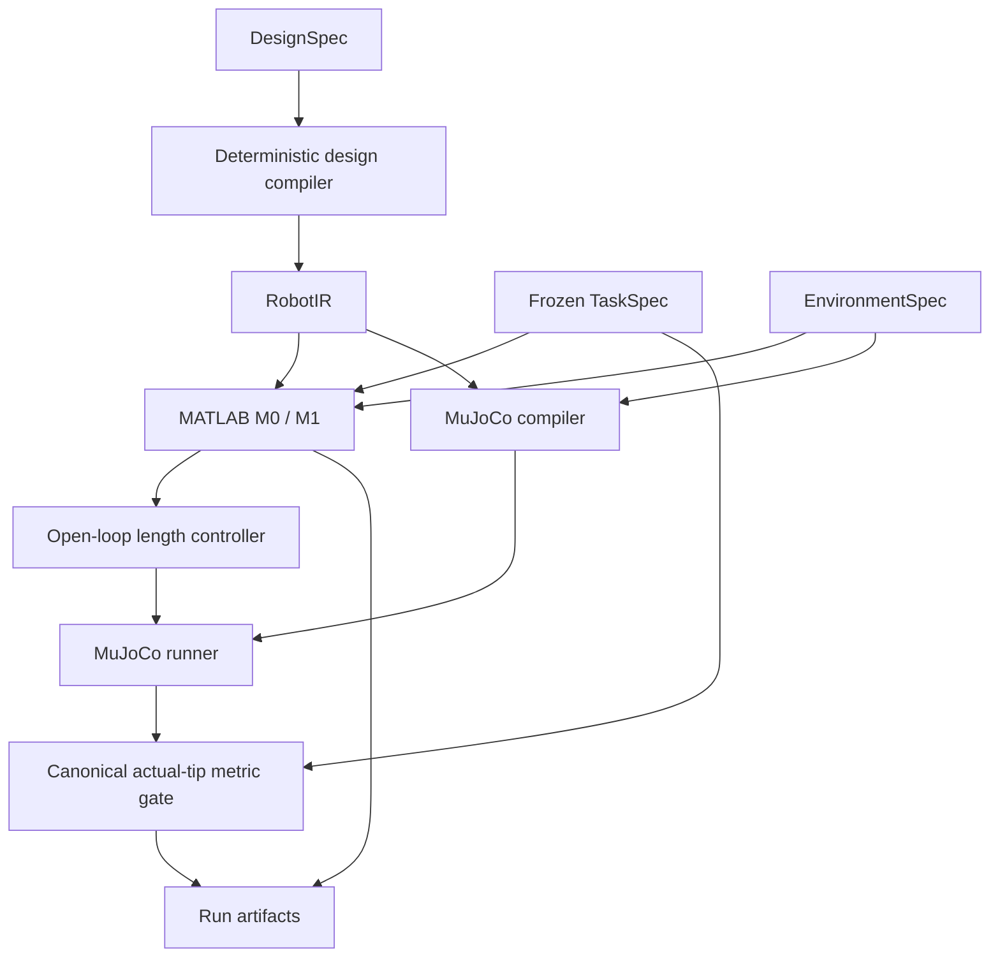

# Softrobot deterministic research harness

This repository runs a tendon-driven continuum V1 research pipeline without any
LLM API. It preserves the main@245a785 kinematic and low-fidelity segmented
MuJoCo surrogate behavior. TASK_FAILED is a valid, recorded scientific outcome.
There is no automatic retuning, RL, Cosserat, FEM or validated material model.

## Run and test

Use the existing Python environment with Pydantic 2, PyYAML, MuJoCo and a MATLAB
Engine installation matching local MATLAB. No new agent framework is required.
In the current Windows setup:

```powershell
conda activate softagent
python examples/run_reach_pipeline.py
python -m unittest discover -s tests -v
$env:SOFTROBOT_TEST_MATLAB = "1"
python -m unittest discover -s tests -v
```

The first test command skips the three real MATLAB tests unless enabled. The
second includes them. Temporary test runs live under runs/ and are cleaned up.
MATLAB requires a working licensed local installation and process-launch access.
Python's Expat is still loaded before MATLAB DLLs on Windows.

The example prints a unique runs/<id>/ directory. Exit 0 means task PASS; exit 1
means recorded task/model/capability failure or runtime error. Read run.json and
trace.json first; trace.jsonl provides the detailed execution timeline. Missing downstream data is omitted, never fabricated. The
baseline target remains [0.25,0,0.15] m with tolerance 0.01 m. Baseline PCC error
is 0.08714456960728613 m and actual MuJoCo error is 0.17116166894090315 m, hence
TASK_FAILED. The migration reproduces these values (MuJoCo 3.13.0).

## Source-of-truth map

| Layer | Authoritative source / representation |
| --- | --- |
| Task and success threshold | tasks/reach_free/task.yaml |
| Environment geometry, frame, gravity | tasks/reach_free/environment.yaml |
| Frozen MuJoCo environment representation | tasks/reach_free/mujoco.xml, validated against EnvironmentSpec |
| Benchmark membership and evaluator | benchmarks/tendon_v1.yaml |
| High-level design | configs/design_tendon_arm.yaml; schemas/design_spec.py; approved grammar.yaml |
| Resolved robot structure | schemas/robot_ir.py + tools/design_compiler.py; each run saves robot_ir.yaml |
| Physics and actuator assumptions | physics_contracts/*.md; values in legacy_v1_surrogate.yaml |
| Controller | schemas/control_spec.py, controllers/base.py, controllers/open_loop_length.py; run controller.json |
| Simulator numerical settings | configs/simulator.yaml; other engine defaults identified by recorded version |
| Run duration and seed | configs/run.yaml |
| Canonical metrics | metrics/reach.py, with tolerance from TaskSpec |
| Tool implementation / roadmap | capabilities/tools/*/manifest.yaml |
| Agent permissions and outputs | agents/contracts/; agents/*/ROLE.md |
| Factual evidence | runs/<id>/ snapshots, results, state, trace, hashes and versions |
| Memory | Future historical index; schemas/memory.py contract only |
| Skill | skills/ versioned strategies, evidence and Human admission; initially empty |



MATLAB validates the same environment frame/identity but M0/M1 omit gravity and
contact; those fields are not silently modeled. RobotIR provides shared length,
routing angles/offsets and surrogate fields; model-specific omissions are explicit.

## Gates and authority

Spec gate validates schemas and frozen environment representation. Design/grammar
gate checks deterministic capability support. Physics sanity checks model loading
and finite qpos/qvel/final tip; this is not a physical validation certificate.
Task metric gate applies final Euclidean error <= frozen tolerance to the actual
MuJoCo tip. A finite PCC plan may pass with model_task_success=false. Diagnosis
can explain a failure but cannot change these decisions.

Human owns tasks, benchmarks, scientific schemas, grammar, contracts and canonical
metrics. Engineer proposes routes/designs; Coding implements approved capabilities;
Diagnosis reports evidence-based hypotheses. See agents/contracts/README.md for
permissions and limits. The tested permission helper is a future executor contract,
not OS sandboxing; no LLM runtime or autonomous writer is implemented here.

## Migration and recovery

The old example command remains valid and now calls tools.harness.run_reach.
configs/task_reach.yaml stays as a deprecated compatibility copy: load_task checks
it against the frozen task. configs/design_tendon_arm.yaml is unchanged. The legacy
mujoco/environments/reach_free.xml stays as a tested reference but is not a second
executable source. compile_mujoco and MATLAB adapters accept DesignSpec for old
callers and compile it through the shared RobotIR compiler; the Harness builds
one IR and passes it to both. validate_task delegates to run_task with the C1
controller (or C0 passive when no command is supplied). matlab_analysis remains
a registry alias for the model bundle. Raw legacy failure codes are retained;
schemas/failure_taxonomy.py supplies a separate top-level category mapping.

Each run saves task/environment/design snapshots, robot IR, available model/command/
controller/MuJoCo results, generated robot.xml, final qpos/qvel, separate model and
MuJoCo metrics, and a gate trace. run.json records UTC timestamp, git commit/dirty
state, Python/MATLAB/MuJoCo versions, model/control levels, seed, final status and
SHA-256 hashes of exact artifact bytes. runtime.json records dependency versions.
source_snapshot.zip preserves current source/contracts/settings even with uncommitted
changes. Hashes detect changes; they are not a cryptographic signature against a
writer who can replace the whole run.

To inspect/reproduce the MuJoCo stage, verify hashes, load saved task.yaml and
controller.json, then call run_task on saved robot.xml with saved run_settings.yaml
in the recorded MuJoCo version. MATLAB regeneration additionally requires the
recorded MATLAB version, source snapshot and license. External runtimes themselves
are not bundled, and bitwise reproducibility across versions/platforms is not claimed.
Memory may summarize these facts later but must retain evidence links.

## Capability boundaries and open science

Implemented: spec validation/IR compiler; M0 geometric screening and M1 PCC;
C0 passive and C1 fixed length execution; deterministic MuJoCo compilation,
finite-state checks and final reach evaluation; artifacts and deterministic resolver.
Planned manifests contain no callable: extended mechanics/dynamics, optimization,
feedback/model-based control, advanced diagnostics, general metrics and learning. Future
reach_window/catch_drop/catch_ramp/stabilize_tip have no executable task package.

Resolver states are SUPPORTED, PARAMETRICALLY_SUPPORTED, IMPLEMENTATION_REQUIRED,
OUT_OF_GRAMMAR and PHYSICS_ASSUMPTION_REQUIRED. Current sections=2 is outside the
approved grammar. Only after Human expands that grammar can it become an
implementation-required design; this migration does not expand the grammar.
Legal segmentation/tendon-count variation is executable, not scientifically validated.

Human decisions still needed: material/EI to equivalent hinge stiffness, damping
source, tendon elasticity/slack/friction, validated actuator dynamics and calibration,
and multi-section physics/coupling. No scientific law is supplied to fill these gaps.

## Round 1: provenance and failure evidence

The unchanged reach_free command now produces diagnostic_summary.json and four
deterministic diagnostic ToolResults: compare_model_sim, check_actuator_limits,
check_tendon_tracking and inspect_numerics. They report whether M1 already predicts
tolerance failure, model-to-simulation tip discrepancy, final tendon tracking,
maximum-pull saturation versus the zero-force no-push bound, finite state, warnings and state
peaks. TASK_FAILED does not establish MODEL_MISMATCH or CONTROL_FAILURE. Without
approved causal/mismatch criteria, attribution remains UNKNOWN. See
[diagnostic tool documentation](capabilities/tools/diagnostics/TOOL.md).

provenance.json contains per-parameter values, units, category, source and
scientific status from executed inputs. Stiffness=0.1 N m/rad, damping=0.1 N m s/rad,
density=1000 kg/m^3, tendon servo gain=1000 N/m and force limit=20 N are explicitly
legacy_v1_surrogate and unvalidated. Segment lengths/routing are approved geometric
derivations; MuJoCo derives capsule mass/inertia from geometry and surrogate density.
Neither is a validated continuum material law. Resolved contact and numerical
engine defaults are also recorded with version. Task/environment facts, controller
commands, simulator settings and run duration stay separate categories.

Optimization approval lives in the existing family grammar. There are currently
**no approved optimization variables or bounds**. Human defines the allowed set,
bounds/units/constraints, provenance and objective authority. Engineer selects
approved names; a future optimizer supplies bounded values. Selection/candidate
validators reject unauthorized fields/changes, and Coding permissions protect
policy/objective/tolerance/benchmark. optimize_design and run_parameter_sensitivity
remain PLANNED; no optimizer or retuning is implemented.

Coding permissions are an application-level contract, not OS/process isolation.
Before autonomous Coding LLM writes, add an isolated worktree, permission-enforcing
executor, post-run diff allowlist and Human review. See
[authority and isolation](agents/contracts/README.md) and
[open scientific decisions](proposals/engineer/round1_physics_questions.md).

## Round 1.5: trace and skill infrastructure

Every Harness run now keeps the compatible `trace.json` and a bounded, hierarchical
`trace.jsonl`: actual stage/tool calls, capability/controller choices, diagnostics,
and structured canonical gate evidence. Both traces are finalized, validated and
hashed in `run.json`; raw simulation data remains in factual artifacts.

Artifact != Trace != Memory != Skill. `CandidateFinding` records exact observations
with evidence links and UNKNOWN causal attribution. The optional explicit post-run
extractor creates no Skill. Machine-readable Skill contracts, deterministic
admission, immutable revisions, negative validation history and approved-only
metadata retrieval are implemented. Production candidates/approved/deprecated
collections start empty; the reach pipeline is independent of retrieval.

Human approval follows validation and binds the exact skill content. A Skill
cannot grant permissions, override task truth or invent physics. MemoryRecord and
Skill Curator role contracts describe future integration only. No LLM, Memory DB,
automatic Skill generator/curator or autonomous agent has been introduced.

See [trace architecture](docs/trace_skill_architecture.md),
[Skill Library](skills/README.md) and [Round 1.5 results](docs/round1_5_result.md).
