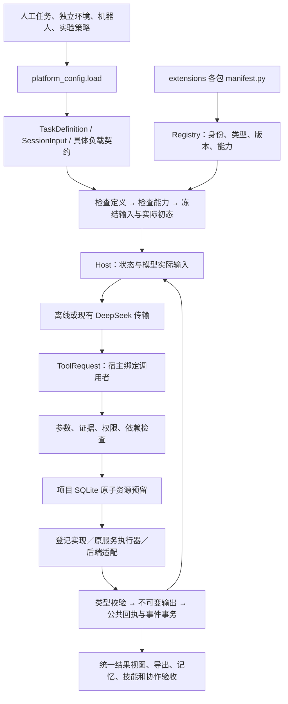

# 统一机器人智能设计开发平台

第一遍七层整理现已接通持久路线。入口为 `python examples/workbench.py platform route ...`；使用方法、真实调用边界及本轮验证见 [步骤 7 与收尾](step7_result.md)。LLM 编排与 Harness 贯穿各层，不是新增的第八层或第二套 Agent 框架。

真实 LLM 路线的可用性修订见 [最终可用性检查](route_usability.md)：`build → run（仿真并评价）→ evidence/diagnose → finish` 已定向验证；本轮没有模型服务凭据，真实 LLM 验收仍未验证。架构接通、模型自主交付、机器人达到容差是三个独立结论。

| 层 | 当前权威输入 | 输出与公共入口 | 已实现 / 主要缺口 |
|---|---|---|---|
| 1 任务与实验 | 冻结 `SessionInput.task`、目标/评价器/环境/初态/Timing | `platform check/create`、`compile_input` → 实例身份、实验装配 | 串联软臂到达开发任务；没有通用物理任务生成 |
| 2 机器人与设计空间 | `family.design`、`family.space`，用户准许的完整模板与参数范围 | `design.family_build`、路线 build、`candidate.family` → 完整候选及物理输入 | 串联柔性段、连接件、导向与载荷；分支、闭链等仍未执行 |
| 3 数学模型 | `policy.dynamics_model` 与 `discretization` | `model.serial_bending_cells`、`resolve_execution` → 坐标/方程身份及兼容关系 | 逐单元双轴弯曲；通用 PCC/GVS、扭转/剪切/轴向伸长未实现 |
| 4 规划与控制 | 授权组合中的 `controller.family` 与候选 `control/*` | 实时 Controller、执行计划 → 具名驱动指令 | 确定性参考与末端反馈；通用轨迹规划与新控制算法未增加 |
| 5 优化 | 固定任务目标、结构选择、连续变量/范围与试验预算 | 路线 optimize → `optimization.optimize` → `run_search` → 最佳有效评价/配置引用 | 有界坐标搜索、重复有效配置跳过、检查点；非全局最优或混合整数求解器 |
| 6 数值执行与仿真 | 冻结候选、模型/控制、后端专用数值设置 | `Host.invoke(simulation.run)` → `BackendResult` 与 ExportBundle | 独立 MuJoCo/MATLAB 后端；无新动力学/积分算法，接触精度未标定 |
| 7 评价、诊断与证据 | 固定评价器、保存轨迹、来源执行与候选身份 | `evaluation.run`、`diagnostics.saved_trajectory`、`evidence.read`、按需视频 → 评价/观测/回执 | 摘要、分页、独立后端复核；观测不自动证明因果，文本适配器不看视频 |

用户在 `inputs/route.json` 冻结任务、设计空间、已实现计算组合和总预算。现有模型适配器 → `ToolRequest(route.advance)` → Host/Registry 校验结构化选择 → 子会话优化或公共复核 → 原仿真/评分/诊断 → Store 节点结果 → 下一轮模型选择或停止。`route.inspect`、上下文摘要及现有工作台 status/export 都能查看路线；输入和结果通过原 Store 保存，节点关联请求、执行、候选、证据与后续理由。项目预算与父路线预算同时限制子会话，外层不再次计求解或等待耗时。

`build` 只构建和校验，明确返回“未仿真、未评价”，没有位置误差或轨迹。`run` 的 `source_node` 必须引用一个完成的 build 节点，以其不可变配置创建/复用子会话，调用原 `simulation.run` 后调用 `evaluation.run`，无需优化变量。`optimize` 可从 build/run/optimize 的保存配置开始；省略来源时仍使用原基线。`variables[path]=[lower_bound,upper_bound]` 表示连续区间，不是两个采样值。诊断、复核、视频、finish 均支持有效的单次 run 或优化结果。

模型上下文与 `route.inspect` 共用紧凑概览，保留已选候选、求解/评价存在性、引用、授权空间、额度及各动作前提。完整任务只在上下文保留一份；设计模板和配置通过冻结快照引用及 JSON Pointer 读取。`evidence.read` 返回 `kind=content/overview`、条目数和 `next_offset`，过大的单个子树返回可跟随的指针；分页预算包含响应信封及 Host observation 余量。英文投影注明 `presentation=english_projection`，字符串分页偏移指向投影文本；Store 原文不改。工具说明以注册声明为权威，生成目录不手改。

真实模型每轮必须恰好调用一个工具，收到结果后再选下一步；`route.inspect` 与 `evidence.read` 分轮执行，正常交付使用 `route.advance` 的 `action="finish"`。零调用或多调用在每个会话内有一次协议纠正机会：原始回复和失败回执保留，下一次实际请求携带调用数量、回复引用和纠正要求，使用新的 `model-N` 身份并占用原有轮数、项目及会话模型预算。纠正待处理时不生成终局；再次解析失败或纠正预算不足会保存明确原因并收尾。恢复读取已有回执和纠正状态；已预留但完成情况未知的请求保持 `needs_input`，不自动重发。已封存路线保持不变。

`route start/resume` 遇到 `failed` 或 `needs_input` 返回 1；明确终止但没有有效评价的交付标为 `delivery_status=incomplete`，返回 2。正常停止的有效交付即使 `final.task_success=false` 仍返回 0。`explicit_delivery` 区分模型 finish 与 Host 终止汇总；历史终局不重写。`counts.solves` 与搜索 `actual_solves` 来自计费账本，包含评分前失败的尝试；`successful_integrations` 单列后端完成次数。当前 DeepSeek 服务、模型和 thinking 设置沿用 `configs/deepseek.yaml`，未新增传输参数。新的定向检查为 `tests.test_route_usability`（其中一个用例执行一次真实 MuJoCo 积分，其余采用明确标注的合成输出）。

在已配置 `DEEPSEEK_API_KEY` 的 `softagent` 环境中，从新目录进行一次真实调试（会消耗模型预算并可能启动已有求解器）：

```powershell
$routeDebug = "runs/route_protocol_$(Get-Date -Format yyyyMMdd_HHmmss)"
python examples/workbench.py platform route prepare $routeDebug
if ($LASTEXITCODE -eq 0) { python examples/workbench.py platform route start $routeDebug }
```

“第一遍完成”表示职责清楚、公共工具可调用、路线可保存和恢复；不表示算法成熟、物理能力齐全或任务已达到 10 mm 容差。下一阶段按具体任务逐层打磨。

> 串联绳驱家族的推荐会话现在把公共实验、实体/离散、动力学模型、执行后端数值设置和控制分别表达；模型服务仍使用 `ExperimentPolicy.model`，机器人动力学使用 `ExperimentPolicy.dynamics_model`。详见 [绳驱家族入口](tendon_family.md) 与 [步骤 3–4 结果](steps_3_4_result.md)。

当前真实串联绳驱双后端入口见 [机器人、离散、任务与共同实验装配](tendon_family.md)。原单段独立空间模型见 [公共物理、空间模型与统一场景](platform_spatial.md)，其模型身份和兼容入口继续保留。

步骤 5–6 的公共请求为 `family.optimization_request`：嵌入 `SessionInput`（任务目标、评价器约束、模型、后端、控制和预算），先选完整模板，再经 `candidate.family` 做实体/控制连续搜索。`extensions.tendon_family.optimization.optimize(root, request)` 调用现有 `platform_search.run_search` 和 Host；注册搜索适配 `search.family_coordinate` 复用 `coordinate_proposal`，首个候选是所选结构下的基线。数值离散固定，轨迹优化未支持。结果保留最佳有效候选、完整 `CandidateInput` 引用、评价证据和停止原因；另一后端复核单列，不混排。

`diagnostics.saved_trajectory@2.0.0` 与 `visualization.render_simulation_video@2.0.0` 现接受家族 `BackendResult` 和执行引用。它们复用 `ExportBundle` 的恢复与封存：诊断适配具名信号；视频沿用有超时的原生渲染/编码执行器。两者均不求解或评分。见 [本轮结果](steps_5_6_result.md)。

这是当前开发总入口，用于共同开发任务、分析、仿真、控制、评价、搜索、诊断、记忆、技能及工作者。各工具与契约独立版本化，不存在一个适用于所有接口的统一版本号。历史到达实验仍是具体项目，不是平台的命名或授权来源。

推荐入口是 `python examples/workbench.py platform ...`：`examples/workbench.py` 将 platform 后的参数转交 `examples/development_platform.py` 的 main；直接调用后者使用同一解析器和宿主，不是另一套平台。以下命令从仓库根目录运行，使用 `conda activate softagent`。文件参数相对于调用者工作目录；配置内引用相对于配置文件，执行器源码相对于仓库根目录。新包从 [扩展指南](platform_extensions.md) 和 [责任划分](platform_parallel_development.md) 开始。

当前 ToolReceipt／EvaluationResult 默认 **1.2.0**，含 `original_execution_id`；WorkerOutput 为 **2.0.0**，其余契约按各自源码版本。工具 `tool_version` 与返回内容的 `result_version` 分开记录。仿真同会话复用保留本次调用身份并指向原始执行，缓存调用不新增求解费用；相同请求重试返回原回执。兼容旧版本、精确匹配及来源读取见 [接口决策](platform_interface_decisions.md) 和 [缓存与恢复](platform_recovery.md)。

## 分层与运行顺序

当前家族链路的职责和权威来源如下。`ExperimentSpec` 是带身份的组合视图，不复制可编辑目标或物理参数。

| 对象 | 权威来源 | 读取者与派生物 |
|---|---|---|
| 实体设计与物理输入 | prepare 后的 `inputs/design.json`；`family.design` | `candidate.py` 构建最终设计；`compiler.py` 解析截面、质量、惯量、刚度、阻尼、绳路与传动 |
| 设计空间与候选选择 | `inputs/space.json`、`inputs/<candidate>_request.json` | `preparation.py` 和公共 `candidate.family`；生成候选、来源身份及过期检查 |
| 模型离散 | `inputs/discretization.json`；`ExperimentPolicy.discretization` / `family.discretization` | `compiler.py` 生成当前逐刚体、逐关节表示；`cells` 不属于实体设计 |
| 任务 | prepare 后的后端输入文件中的 `TaskDefinition.goal/objectives/evaluator` | `platform_tasks.py`、评价器；生成任务身份和评价结果 |
| 环境与装配 | `TaskDefinition.environment` 的 `experiment.assembly`；initializer | `scene.py`；生成共同场景、具名状态、实体映射、安装和定时外力 |
| 运行方案 | `ExperimentPolicy.backend/controller/discretization`、`Timing`、后端参数 | Host 与后端适配；生成冻结候选输入、求解配置和回执 |
| 结果与证据 | `BackendResult`、SQLite Store、`ExportBundle` | 评价、统一信号、比较、保存回放和证据读取 |

真实调用顺序为：输入文件 → `preparation.prepare_candidate` → `candidate.build` 与公共 `_candidate` → `compiler.resolve` → `scene.assemble` → `platform_tasks.compile_input` → `Host.invoke(simulation.run)` → 独立 MATLAB / MuJoCo → `BackendResult` → `evaluation.run` / `signals.read` / ExportBundle。公共平台负责信封、注册、冻结、预算、缓存、回执与证据；领域扩展负责机器人语义、物理派生和场景；后端只消费共同输入并独立计算；examples 只生成示例配置和调用这些公共入口。

当前推荐入口是 tendon-family。`spatial-example`、旧 `single`、领域样例及原 workbench 继续兼容。`docs/round*`、旧 runs 和 evidence 是历史实验材料。manifest 中声明但返回 implementation-required 的能力，以及预留拓扑、PCC/GVS 通用状态转换、复杂接触和移动平台仍只是计划范围。



1. `tools/platform_config.py` 只组合 YAML/JSON 数据，不解释代码路径。
2. `schemas/platform.py` 定义信封；`extensions/*/contracts.py` 定义具体负载。登记身份加精确版本决定校验器。
3. `tools/platform_tasks.py` 检查任务语义、环境、机器人、执行通道、采样相位、控制及评价能力；初始化器在此确定实际采样和种子。
4. `Host.create` 保存不可变输入、任务实例身份、Git 提交、实际依赖内容身份。创建不会执行求解或模型。
5. `tools/platform_models.py` 组装上下文、记录模型输入、取得一个决定、保存待执行调用，交给同一个 `Host.invoke`。失败修正及无进展重复均有上限。
6. 宿主在项目与会话两个额度范围内原子预留，执行登记实现，并在事务中提交输出、回执、实际费用与事件。未知中断不自动重演。
7. 评价和诊断消费保存结果。模型工作记忆保留回执及分页；跨运行记忆与适用技能可进入下一轮真实传输载荷。

## 权威数据来源

| 对象 | 权威来源 | 生成或派生物 |
| --- | --- | --- |
| 公共信封 | `schemas/platform.py` | `platform_generated/contracts.json` |
| 公共操作输入输出、开发协议 | `schemas/platform_operations.py`、`schemas/platform_protocols.py` | 注册操作的 Schema 见 capabilities.json；Python Protocol 本身不是序列化契约 |
| 具体扩展负载、实现绑定 | `extensions/<包>/contracts.py`、`manifest.py` | 生成能力目录和模型工具声明 |
| 任务科学定义 | 输入任务文件；运行时以 SQLite 中的输入快照为准 | 任务版本、实例身份和初始化结果 |
| 实验策略、权限、预算 | 项目授权配置、会话策略快照、授权锚点 | 剩余额度查询 |
| 机器人结构、声明物理参数 | 原 `RobotIR`／物理契约，或明确标识的参考模型契约 | `RobotIRProvider` 的带单位查询 |
| V1 编译质量和惯量 | 原求解器导出的 `shared_input.json`，保留模型和摘要 | `SharedModel` 查询；不从新抽象猜公式 |
| 数值轨迹 | 原后端导出字节与类型化外层信号 | 新评价、诊断、曲线／视频和报告 |
| 事件、回执、资源、输出 | 项目 `platform.sqlite` 的事务记录及不可变内容表 | HTML、导出 JSON、检索上下文 |
| 技能版本与验证 | 原 `SkillRegistry` 生命周期；平台开发库独立保存 | 适用技能上下文 |

原文件未搬迁：`tools/dynamic_campaign.py`、`dynamic_actions.py`、`workbench.py`、`harness.py`、`public_gateway.py` 等继续使用历史授权边界。新项目复用 `service_execution.py`，费用只由平台账本承担；旧入口仍由原账本结算。平台不会给历史 grant 追加额度。

`python examples/export_platform_contracts.py` 从当前源码和注册包生成 `docs/platform_generated/`；不要手改生成 JSON 来定义接口。能力目录包含当前工作区的扩展，依赖可用性反映生成时环境；无会话时的 `NO_SESSION_POLICY` 不表示实现缺失。`IMPLEMENTATION_REQUIRED` 表示未提供可发现实现，`DEPENDENCY_MISSING` 表示环境缺依赖；二者可同时存在。`implementation_exists=true` 只检查绑定符号存在，`runtime_probe=not_started`，不保证其方法已完成或后端经过物理验证。

可执行参考是 `extensions/reference`、`extensions/convergence` 及 `configs/platform/signal_hold/`、`configs/platform/convergence/`；其中离散信号和离线适配只验证接口。`docs/templates/platform/extension/*_skeleton.py` 和 Genesis 声明仍待实现。旧 public_tools／dynamic／workbench 实验入口作为兼容实现保留，其报告不覆盖当前公共接口说明。

## 快速使用

改变真实机器人的结构／物理／控制参数，优先使用 [领域接入示例](platform_domain.md)：唯一 DesignSpec → 原编译器 → simulation.run → 评价、统一信号及平台引用诊断。下列 signal_hold 是合成接口示例，不能替代真实机器人验证。

```powershell
conda activate softagent
python examples/workbench.py platform catalog
python examples/workbench.py platform check configs/platform/signal_hold/session.yaml
python examples/workbench.py platform check configs/platform/reach_shifted/session.yaml
python examples/workbench.py platform project-create runs/my_platform configs/platform/project.yaml
python examples/workbench.py platform create runs/my_platform configs/platform/signal_hold/session.yaml
python examples/workbench.py platform run runs/my_platform signal-hold --decisions configs/platform/offline.yaml
python examples/workbench.py platform status runs/my_platform signal-hold
python examples/workbench.py platform inputs runs/my_platform signal-hold
python examples/workbench.py platform events runs/my_platform signal-hold
python examples/workbench.py platform export runs/my_platform signal-hold runs/my_platform/signal_hold.html
```

示例 project grant 只能绑定一个本地项目路径。重送应使用原项目；独立新授权需显式新 grant 与额度。不要为绕过已用额度修改 grant 名称。默认示例模型是离线适配，没有 API 请求；`run` 的模型、权限及预算来自已冻结策略。

`status / resources / events / inputs / context / compatibility / evidence / memory / skills / catalog / check / history` 都是只读操作，不启动后端、不更新资源、不创建会话。`context` 是预览；只有 `inputs` 对应的投递事件证明该内容已提交给适配器。

## 文档导航

- [机器人领域能力、参数、信号与真实接入示例](platform_domain.md)
- [历史基线审计表与阶段记录](platform_progress.md)
- [当前接口版本与兼容决策](platform_interface_decisions.md)
- [人工任务填写指南](platform_tasks.md)
- [扩展指南与模板](platform_extensions.md)
- [记忆、技能及运行时协作](platform_collaboration.md)
- [多人并行开发责任和流程](platform_parallel_development.md)
- [历史兼容、缓存与恢复](platform_recovery.md)
- [调试手册](platform_debugging.md)
- [验收结果与未实现边界](platform_validation.md)
- [生成能力目录](platform_generated/catalog.md)、[机器可读契约](platform_generated/contracts.json)、[机器可读能力](platform_generated/capabilities.json)
