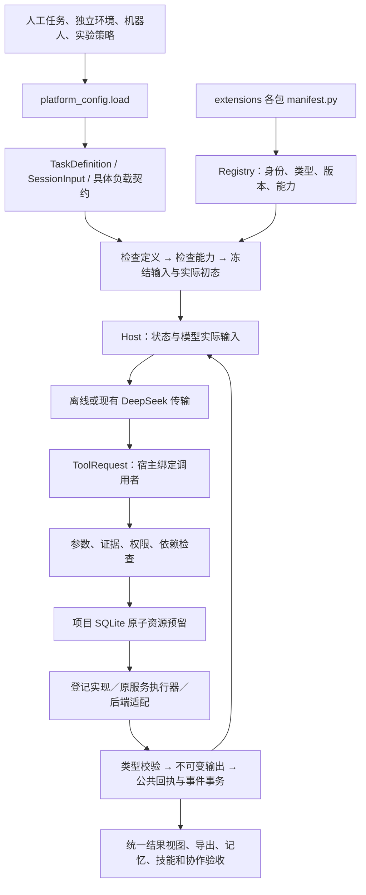

# 统一机器人智能设计开发平台

真实的独立数学／物理双后端开发入口见 [公共物理、空间模型与统一场景](platform_spatial.md)；旧 MATLAB 共享导出路径的 MuJoCo 依赖不适用于新数学后端。

这是当前开发总入口，用于共同开发任务、分析、仿真、控制、评价、搜索、诊断、记忆、技能及工作者。各工具与契约独立版本化，不存在一个适用于所有接口的统一版本号。历史到达实验仍是具体项目，不是平台的命名或授权来源。

推荐入口是 `python examples/workbench.py platform ...`：`examples/workbench.py` 将 platform 后的参数转交 `examples/development_platform.py` 的 main；直接调用后者使用同一解析器和宿主，不是另一套平台。以下命令从仓库根目录运行，使用 `conda activate softagent`。文件参数相对于调用者工作目录；配置内引用相对于配置文件，执行器源码相对于仓库根目录。新包从 [扩展指南](platform_extensions.md) 和 [责任划分](platform_parallel_development.md) 开始。

当前 ToolReceipt／EvaluationResult 默认 **1.2.0**，含 `original_execution_id`；WorkerOutput 为 **2.0.0**，其余契约按各自源码版本。工具 `tool_version` 与返回内容的 `result_version` 分开记录。仿真同会话复用保留本次调用身份并指向原始执行，缓存调用不新增求解费用；相同请求重试返回原回执。兼容旧版本、精确匹配及来源读取见 [接口决策](platform_interface_decisions.md) 和 [缓存与恢复](platform_recovery.md)。

## 分层与运行顺序



1. `tools/platform_config.py` 只组合 YAML/JSON 数据，不解释代码路径。
2. `schemas/platform.py` 定义信封；`extensions/*/contracts.py` 定义具体负载。登记身份加精确版本决定校验器。
3. `tools/platform_tasks.py` 检查任务语义、环境、机器人、执行通道、采样相位、控制及评价能力；初始化器在此确定实际采样和种子。
4. `Host.create` 保存不可变输入、任务实例身份、Git 提交、实际依赖内容身份。创建不会执行求解或模型。
5. `tools/platform_models.py` 组装上下文、记录模型输入、取得一个决定、保存待执行调用，交给同一个 `Host.invoke`。失败修正及无进展重复均有上限。
6. 宿主在项目与会话两个额度范围内原子预留，执行登记实现，并在事务中提交输出、回执、实际费用与事件。未知中断不自动重演。
7. 评价和诊断消费保存结果。模型工作记忆保留回执及分页；跨运行记忆与适用技能可进入下一轮真实传输载荷。

## 权威数据来源

| 对象 | 权威来源 | 生成或派生物 |
| --- | --- | --- |
| 公共信封 | `schemas/platform.py` | `platform_generated/contracts.json` |
| 公共操作输入输出、开发协议 | `schemas/platform_operations.py`、`schemas/platform_protocols.py` | 注册操作的 Schema 见 capabilities.json；Python Protocol 本身不是序列化契约 |
| 具体扩展负载、实现绑定 | `extensions/<包>/contracts.py`、`manifest.py` | 生成能力目录和模型工具声明 |
| 任务科学定义 | 输入任务文件；运行时以 SQLite 中的输入快照为准 | 任务版本、实例身份和初始化结果 |
| 实验策略、权限、预算 | 项目授权配置、会话策略快照、授权锚点 | 剩余额度查询 |
| 机器人结构、声明物理参数 | 原 `RobotIR`／物理契约，或明确标识的参考模型契约 | `RobotIRProvider` 的带单位查询 |
| V1 编译质量和惯量 | 原求解器导出的 `shared_input.json`，保留模型和摘要 | `SharedModel` 查询；不从新抽象猜公式 |
| 数值轨迹 | 原后端导出字节与类型化外层信号 | 新评价、诊断、曲线／视频和报告 |
| 事件、回执、资源、输出 | 项目 `platform.sqlite` 的事务记录及不可变内容表 | HTML、导出 JSON、检索上下文 |
| 技能版本与验证 | 原 `SkillRegistry` 生命周期；平台开发库独立保存 | 适用技能上下文 |

原文件未搬迁：`tools/dynamic_campaign.py`、`dynamic_actions.py`、`workbench.py`、`harness.py`、`public_gateway.py` 等继续使用历史授权边界。新项目复用 `service_execution.py`，费用只由平台账本承担；旧入口仍由原账本结算。平台不会给历史 grant 追加额度。

`python examples/export_platform_contracts.py` 从当前源码和注册包生成 `docs/platform_generated/`；不要手改生成 JSON 来定义接口。能力目录包含当前工作区的扩展，依赖可用性反映生成时环境；无会话时的 `NO_SESSION_POLICY` 不表示实现缺失。`IMPLEMENTATION_REQUIRED` 表示未提供可发现实现，`DEPENDENCY_MISSING` 表示环境缺依赖；二者可同时存在。`implementation_exists=true` 只检查绑定符号存在，`runtime_probe=not_started`，不保证其方法已完成或后端经过物理验证。

可执行参考是 `extensions/reference`、`extensions/convergence` 及 `configs/platform/signal_hold/`、`configs/platform/convergence/`；其中离散信号和离线适配只验证接口。`docs/templates/platform/extension/*_skeleton.py` 和 Genesis 声明仍待实现。旧 public_tools／dynamic／workbench 实验入口作为兼容实现保留，其报告不覆盖当前公共接口说明。

## 快速使用

改变真实机器人的结构／物理／控制参数，优先使用 [领域接入示例](platform_domain.md)：唯一 DesignSpec → 原编译器 → simulation.run → 评价、统一信号及平台引用诊断。下列 signal_hold 是合成接口示例，不能替代真实机器人验证。

```powershell
conda activate softagent
python examples/workbench.py platform catalog
python examples/workbench.py platform check configs/platform/signal_hold/session.yaml
python examples/workbench.py platform check configs/platform/reach_shifted/session.yaml
python examples/workbench.py platform project-create runs/my_platform configs/platform/project.yaml
python examples/workbench.py platform create runs/my_platform configs/platform/signal_hold/session.yaml
python examples/workbench.py platform run runs/my_platform signal-hold --decisions configs/platform/offline.yaml
python examples/workbench.py platform status runs/my_platform signal-hold
python examples/workbench.py platform inputs runs/my_platform signal-hold
python examples/workbench.py platform events runs/my_platform signal-hold
python examples/workbench.py platform export runs/my_platform signal-hold runs/my_platform/signal_hold.html
```

示例 project grant 只能绑定一个本地项目路径。重送应使用原项目；独立新授权需显式新 grant 与额度。不要为绕过已用额度修改 grant 名称。默认示例模型是离线适配，没有 API 请求；`run` 的模型、权限及预算来自已冻结策略。

`status / resources / events / inputs / context / compatibility / evidence / memory / skills / catalog / check / history` 都是只读操作，不启动后端、不更新资源、不创建会话。`context` 是预览；只有 `inputs` 对应的投递事件证明该内容已提交给适配器。

## 文档导航

- [机器人领域能力、参数、信号与真实接入示例](platform_domain.md)
- [历史基线审计表与阶段记录](platform_progress.md)
- [当前接口版本与兼容决策](platform_interface_decisions.md)
- [人工任务填写指南](platform_tasks.md)
- [扩展指南与模板](platform_extensions.md)
- [记忆、技能及运行时协作](platform_collaboration.md)
- [多人并行开发责任和流程](platform_parallel_development.md)
- [历史兼容、缓存与恢复](platform_recovery.md)
- [调试手册](platform_debugging.md)
- [验收结果与未实现边界](platform_validation.md)
- [生成能力目录](platform_generated/catalog.md)、[机器可读契约](platform_generated/contracts.json)、[机器可读能力](platform_generated/capabilities.json)
