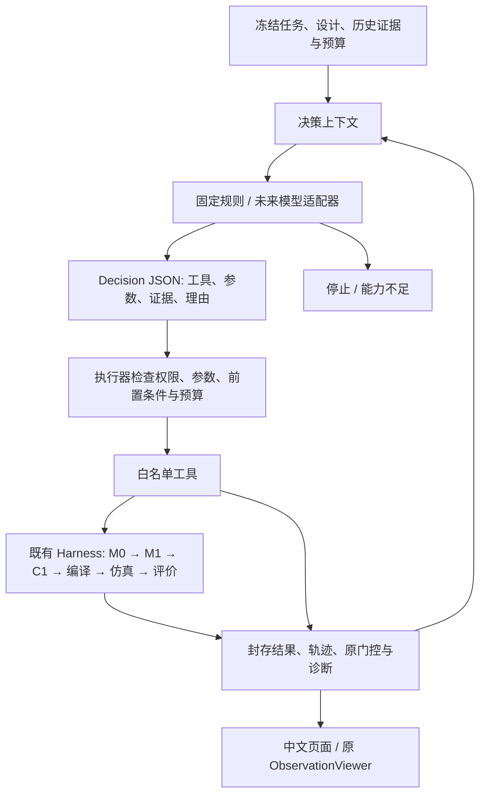

# 第五轮：机器人设计工作台

在 `feat/round4-tools-visualization@c7e0dd5` 上增加通用工作台，原 Harness、评价、控制器、编译器与观察器继续提供实际能力。本轮不接真实大语言模型，不开展长度搜索或标定。

## 最简单的运行与观察

在仓库目录、现有 `softagent` 环境运行：

```powershell
conda activate softagent
python examples/workbench.py run
python examples/workbench.py observe runs/workbench_demo
```

浏览器打开 <http://127.0.0.1:8765>。也可以直接打开 `runs/workbench_demo/index.html`，完成后无需服务。运行中的页面推荐通过只读服务查看，它会每 5 秒读取保存状态及子运行阶段。要同时观察执行，在第二个终端执行 observe 命令。

本机第五轮新增评价在 MATLAB 启动时失败，未产生实际数值调用；已保存为 `runs/round5_demo`，没有重试。已验证的完整反馈闭环使用封存历史运行回放，**不需要 MATLAB、不启动仿真**：

```powershell
python examples/workbench.py observe runs/round5_replay_complete
```

从原始保存运行创建另一份只读闭环的命令如下。新目录不可与已有目录同名：

```powershell
python examples/workbench.py run --root runs/my_replay --replay-run runs/20260912T082002_895497Z_10d68758
```

回放校验原 RunRecord 的全部文件哈希、源码快照及 trace，逐字节复制封存文件，并检查任务、环境、设计与 C1 身份。历史代码版本保留在原记录中；页面和后续决策明确标注“历史回放 FAIL / 本轮 NOT_RUN”，不把旧数值当作新执行结果。`--replay-run` 只能在创建时选择，MATLAB / MuJoCo 预算均锁为 0；模型不能把回放切换成新实验。自动跨工作台数值缓存尚未实现。

默认固定上限为 **1 次 MuJoCo、2 次 MATLAB 分析、10 次工具尝试、14 次决策**。每个工具进程最多 180 秒；时间限制包含进程启动、MATLAB 启动和工具工作。预算耗尽不自动增加。预算按尝试预扣，失败、中断也不返还；实际后端调用数看原 Harness 的 `trace.jsonl`。任务未达标不等于工作台失败。

一次可暂停、带历史证据的运行：

```powershell
python examples/workbench.py run --root runs/my_workbench --history docs/evidence/round4/length_summary.json --steps 2
python examples/workbench.py resume runs/my_workbench
python examples/workbench.py observe runs/my_workbench
```

`--steps` 只限制本次进程执行多少个决策，不提高总预算；`--steps 0` 只初始化。`--simulations 0` 可运行检查和数学分析后停在预算边界。已有目录不能覆盖；重复 resume 已停止工作台不会重跑。

## 接口与流程



`schemas/workbench.py` 定义 Decision 与 WorkbenchResult。`tools/workbench_policy.py:decide(context)` 只选择下一步；不调用工具、不设置成绩。`tools/workbench.py:Workbench.run` 获取单写锁、构建上下文，`submit` 验证并执行请求。`tools/workbench_actions.py` 是明确列举的可信适配器，无动态模块加载或任意 Python 执行。

默认规则：读取已登记的第一份历史证据（如有）→任务与设计检查→PCC 直态局部雅可比→一次原 Harness 完整评价→读取诊断→有轨迹则生成动画和曲线→停止。若工具失败或能力不足，引用错误结果后停止；若无足够后端预算，直接停止。历史结果仅作上下文，不冒充新成绩。其余历史证据可通过 `read_evidence` 读取。

本轮有限迭代指“执行→读取评价反馈→决定诊断/观察→停止”的决策循环，不承诺改良设计。控制方案固定为原 C1 开环生成。数学分析与任务评分分离，PCC 分析只提供几何证据。完整评价内部步骤由原 Harness 门控执行，恢复边界是一次候选评价，不能从仿真中间帧续积分。

## 可执行目录与限制

```powershell
python examples/workbench.py catalog
python examples/workbench.py context runs/my_workbench
```

catalog 输出 Decision / Result JSON Schema、每个工具参数 Schema、前置条件、权限、成本与失败码；另列原库中 IMPLEMENTED / PLANNED 工具。**库中实现不等于通过工作台获准执行**；旧实验入口、C2 搜索、RL、硬件、代码编辑、标定没有加入执行白名单。

| 工具 | 输入 | 前置条件 | 输出 / 成本 |
| --- | --- | --- | --- |
| inspect_task | `{}` | 固定 reach_free 合同和语法内设计 | 合同引用、设计、适用性；0 后端 |
| analyze_design | `{}` | inspect_task 完成 | 现有 PCC 雅可比；0 后端 |
| evaluate_design | `{"controller":"C1"}` | 以上两项完成、后端预算可用 | 原门控、成绩、运行引用；预扣 2 MATLAB + 1 MuJoCo |
| diagnose | `{}` | 评价工具完成 | 原诊断证据，因果归因 UNKNOWN；0 后端 |
| observe | `{}` | 评价完成且有保存轨迹 | 原观察器导出的 GIF、PNG；0 后端 |
| read_evidence | `{"evidence_id":"history:0"}` | 已登记的 JSON 证据 | 原 JSON 内容；0 后端 |

所有请求还消耗决策次数，真正启动工具才消耗工具次数。完全相同请求的封存结果可在本工作台内复用，记入 `reuse`，不再消耗工具和后端预算。跨工作台的数值缓存尚未实现。`--design` 只选择输入设计文件，仍受已有冻结语法约束；不继承历史长度实验的特殊授权。任务包目前固定为 reach_free，其他任务需要单独实现适配与预算定义。

## 保存与恢复

- `request.json`：任务、设计入口、权限、预算、代码提交、dirty 标志、逐文件 SHA256、软件版本。dirty 提交通过 `source_snapshot.zip` 和实际哈希定位。
- `inputs/`：设计与历史 JSON 的原字节副本。历史另存来源路径及角色。
- `state.json`：全部决策及所引用证据的哈希、尝试预留、结果、预算与复用记录。
- `attempts/*/execution/<run>/`：原 Harness 的 task / design / control / IR / XML / 物理来源、软件版本、指标、门控、诊断、轨迹与完整原 trace。
- `attempts/*/worker.log`、`result.json`：异常、超时、能力不足均有结构化结果；动画与曲线另存，不修改原运行。

写入使用现有原子 JSON 服务；操作系统文件锁避免并发执行，进程退出后释放。恢复校验证据、输入、源代码与依赖版本；有原子完成结果则接纳，否则标记 INTERRUPTED，保留已扣成本，不自动重做。若旧工具进程仍持锁，恢复拒绝并发接管。Ctrl+C 会停止该工具进程树并保存中断结果。硬杀进程时未完成实验保留作失败证据，不把半成品当成功缓存。更换代码/依赖后不能混合恢复，应在对应版本恢复或建立新工作台。

工作台锁、白名单和哈希是应用边界，不是操作系统沙箱或防恶意本地文件篡改的签名系统。未来模型只接收 JSON 和已登记证据，不应获得本地 Python、shell、写文件或 worker 模块入口。

## 未来接入大语言模型

模型适配器实现 `decide(context) -> Decision`，替代固定规则函数；上下文包括任务请求、历史证据目录、已完成工具结果、剩余预算和执行工具 Schema。模型提出的每一个动作继续经过同一个 Workbench 执行器。可先用文件提交验证接口：

```json
{
  "action": "continue",
  "tool": "inspect_task",
  "arguments": {},
  "evidence": ["request"],
  "reason": "先核对冻结任务和当前设计的执行能力。"
}
```

保存为 JSON 后，在尚未停止的工作台使用 `python examples/workbench.py resume runs/my_workbench --decision decision.json`。这只处理一个决策。停止请求用 `action: stop`、能力不足用 `action: capability_missing`，均不得附带工具及参数。无效工具、额外参数、未知证据和越权请求被记录为 rejected；连续无效输出最终受决策预算终止。

已具备固定任务 / C1 范围内受限接入条件；尚无真实模型供应商接口、跨工作台检索索引、多候选设计修改、C2 参数提案执行、自动代码修复、硬件权限或经过标定的物理模型。增加这些能力需要明确的适配、权限与验证，不能由模型声明已实现。
