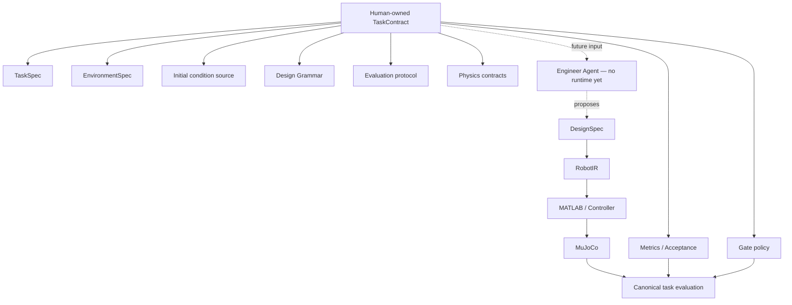

# TaskContract

TaskContract is a Human-owned truth index, not another source of numerical truth.
The Pydantic contract is `schemas/task_contract.py`; `tools.task_contract_tools`
provides `load_task_contract(path)` and `resolve_task_contract(path)`.
Neither function writes or approves sources. JSON Schema is exported by the existing
`python -m tools.export_contract_schemas` command.

| Concept | Authoritative source | Contract reference |
| --- | --- | --- |
| Goal / target | Package task.yaml (TaskSpec) | task_source |
| Environment | Package environment.yaml (EnvironmentSpec) | environment_source |
| Initial condition | tools/mujoco_tools.py: existing MjData initialization for compiled RobotIR, with engine version in run.json/runtime.json | initial_condition_source |
| Design envelope | capabilities/robot_families/tendon_driven_continuum/grammar.yaml | design_grammar_source |
| Metrics | metrics/reach.py: evaluate_reach | evaluator, resolved to its implementation source |
| Acceptance | task.yaml tolerance/explicit acceptance; schemas/task_spec.py owns existing development defaults; proposal candidate_acceptance.yaml owns pending decisions | task_source + acceptance_source |
| Evaluation protocol | configs/run.yaml seed/steps; configs/simulator.yaml timestep; tools/harness.py single attempt/no retry; tools/mujoco_tools.py executes steps without random sampling | run_settings_source, simulator_settings_source, evaluation_protocol_source, initial_condition_source |
| Gate policy | schemas/gate.py actions; tools/harness.py Round 2.5 mapping/criteria; thresholds remain in their original task/model sources | gate_policy_source + gate_mapping_source |
| Physics | Referenced physics_contracts/*.md and legacy_v1_surrogate.yaml | physics_contract_sources |
| Concrete DesignSpec | Caller-selected candidate, default configs/design_tendon_arm.yaml | **Not referenced as task truth** |

The existing MuJoCo XML is also referenced as `environment_representation_source`,
then checked against EnvironmentSpec. It remains a derived representation, not a
second geometry authority. No Gate policy YAML was added: the existing explicit
mapping and action implementation remain the referenced authority. The resolver
accepts only the currently implemented V1 policy/protocol/initialization/physics;
another reference is reported as unsupported instead of silently ignored.



TaskContract defines the problem. DesignSpec proposes a solution. RobotIR defines
the instantiated robot. Physics Contract defines model semantics. Artifacts record
what happened. The current deterministic baseline supplies the candidate in place
of a future Engineer; no Agent runtime or optimization is introduced.

## References and statuses

Source strings beginning `./` resolve relative to the manifest's directory.
All other source paths resolve relative to this repository root. There is no path
search fallback. Evaluators use a module.callable identifier and advertise supported
task types. Resolution checks referenced files, task/environment identity, evaluator
compatibility, grammar presence, supported execution sources and benchmark binding.

| Entry | Status | Meaning |
| --- | --- | --- |
| tasks/reach_free/contract.yaml | FROZEN | Existing Human-owned registered benchmark, tendon_v1 |
| proposals/benchmark/reach_window_v1/contract.yaml | PROPOSED_NOT_APPROVED | Discussion-only view of candidate sources; exact initial state and acceptance remain unapproved |
| tests/fixtures/reach_window_dev/contract.yaml | DEVELOPMENT_ONLY | Software fixture, never a formal benchmark result |

Executable resolutions expose typed TaskSpec, EnvironmentSpec, settings, grammar
and evaluator references in memory. The proposal deliberately has no executable
TaskSpec/EnvironmentSpec/evaluator view: its draft schemas retain their approval
markers and pending initial condition. It still resolves paths, hashes, source
identity and evaluator applicability for discussion. It cannot enter simulation.
The compact serialized resolved view excludes all loaded object contents.

FROZEN cannot reference a development/proposed environment. A benchmark-bound
contract must match the registered task/environment paths, FROZEN entry and evaluator.
Standalone frozen truth requires an explicit HUMAN_APPROVED environment. Formal
windows also require approved explicit acceptance. These consistency checks do not
authenticate approval; existing Human-owned file authority remains in force.

FROZEN does not mean Git can never change the file. Human can approve reach_free_v2
or an explicit revision under the existing version process. Engineer, optimizer,
controller, Diagnosis, evaluator and Coding cannot silently change the current
contract or its authoritative sources. Nothing auto-promotes a proposal.

## Harness and evidence

Existing command: `python examples/run_reach_pipeline.py`.
Existing `--task-package` still works. When contract.yaml exists, Harness resolves
it, snapshots all referenced files using source_snapshot.zip, verifies their bytes
against the resolved hashes, and executes the copied task/environment plus the
referenced evaluator, grammar and run/simulator settings. Gate source identity is
checked against the actual existing implementation. The concrete candidate remains
the independent design_path argument. No calculations or tuning values are changed.

Packages without a contract retain the legacy loader for local tests, with explicit
`task_contract_compatibility` trace and DEVELOPMENT_ONLY run status metadata. Such
runs have no fabricated contract ID and do not count as frozen benchmark runs.
Tests that copy and modify a frozen package must remove that copied contract or
provide a distinct development contract instead of claiming the original benchmark.

Each contract run retains:

- task_contract.yaml: exact manifest snapshot.
- task_contract_resolved.json: contract identity/status, source paths/hashes,
  evaluator ID, Gate policy ID, benchmark ID and unresolved markers only.
- run.json: task_contract_id, task_contract_status, task_contract_hash.
- provenance.json and gate_summary.json: contract identity/scope linkage.
- Existing task/environment/settings/IR/physics/XML/state artifacts and
  source_snapshot.zip: exact referenced source bytes at their repository paths.
- Existing SPEC_VALIDATED event `task_contract_resolved`, before `task_loaded` and
  `environment_validated`, with references to both contract artifacts.

To inspect without starting numerical tools:

```powershell
python -c "from tools.task_contract_tools import resolve_task_contract; print(resolve_task_contract('tasks/reach_free').reference_view())"
```

Engineer reads the index, grammar and registry, with future Memory/Skills as secondary
evidence. Diagnosis reads the saved contract, artifacts and trace to distinguish
screening predictions from actual acceptance. Coding implements approved consumers.
Only Human defines sources, approval and explicit contract promotion/version changes.
