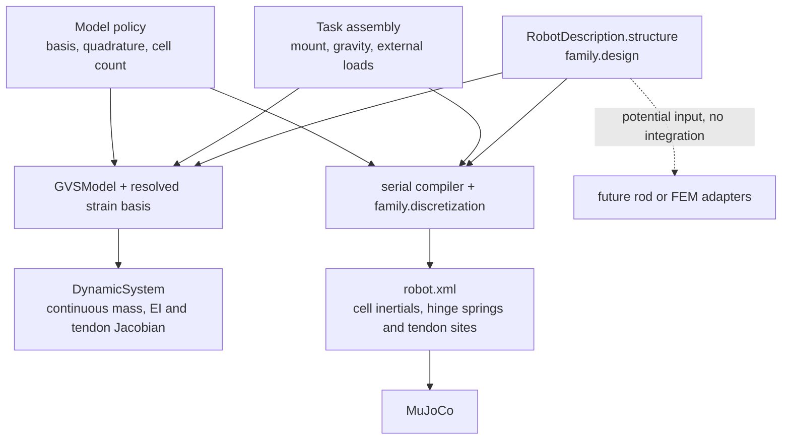

# Stage 3.10: RobotIR physical fact audit

## Executive conclusion

`family.design` is a shared source for the **supported robot design inputs**. It explicitly identifies component geometry, material or equivalent bending inputs, rigid inertials, connections, tendon route bindings, and actuator transmission. It does **not** guarantee that independent GVS and serial-cell generators produce the same deformed shape or generalized forces. Several important quantities—flexible COM and inertia, gravity Jacobians, tendon moment arms, and effective stiffness—are reconstructed under each model's own kinematics and quadrature.

This is an abstraction boundary, not evidence that RobotIR is defective. At the frozen Stage 3.7–3.9 `q0`, coefficient transfer is exact, but the tip differs by 16.743 mm, far-segment COM by 9.321 mm, and generalized gravity force by `1.771e-3` N·m². The material and route fields are shared; the resulting models are not yet physically equivalent. The highest-priority gap for the **current** models is a missing cross-model equivalence criterion with declared approximation provenance and tolerances. Additional physical inputs become necessary only if richer strain, cable, contact, or volumetric behavior is claimed.

This audit reads the frozen `two_segment_development` RobotIR, its separate `family.discretization`, the contracts and generators, and the Stage 3.7–3.9 scientific artifacts. It runs no simulation and changes no schema or physical equation. Full field inventories, source ownership, and trace rows are in `robotir_physical_fact_audit.json`.

## Current ownership and generator map

`RobotDescription` supplies `structure`, channels, units, frame, assumptions and sources. Its `structure` payload is `family.design` (`Design` in `extensions/tendon_family/contracts.py`). `Design.metadata` is descriptive and explicitly disallows hidden physical parameters. The design contains components, tendons, actuators and a named tip. Gravity, mounting and external loads are in the task's `experiment.assembly`, not in RobotIR. The serial mesh is a separate `family.discretization` payload; `Segment.cells` is only a compatibility input and is excluded from canonical design serialization. The GVS basis and quadrature are model parameters, not design fields.

| Domain | Explicit design or scene facts | Derived or separately chosen |
| --- | --- | --- |
| Geometry | Segment length, section stations and interpolation; rigid envelopes and guide holes; connection and tip poses | Continuous strain pose integration versus rigid-cell pose; collision mesh approximation |
| Material and bending | Density and Young modulus **or** line density and principal bending EI; bending viscosity; natural curvature | Section area/moments, flexible mass/inertia, continuous basis stiffness versus hinge constants |
| Rigid mass | `mass_kg`, local COM, full local COM inertia tensor | World COM/inertia after each model places the parent structure |
| Tendons | Ordered start/guide/anchor attachments, holes, diameter, straight frictionless model, pretension, force limit | Deformed lengths, path Jacobians, moment arms and contact/wrap behavior |
| Actuation | Command units/type, drum radius, transmission ratio, travel and speed limits; tendon length-servo gain | Execution mode and command-to-force implementation; motor dynamics are not supplied |
| Task interface | Named tip and robot channels | Goal and scene boundary conditions come from Task/Assembly |
| Discretization | No canonical physical cell count in `family.design` | `family.discretization.cells`; GVS basis, integration and quadrature settings |

## Physical quantity trace and observed consequence

| Quantity | Source fact | GVS interpretation | Serial/MuJoCo interpretation | Stage 3.9 evidence |
| --- | --- | --- | --- | --- |
| Flexible mass | Density or line density × section and length | Gauss quadrature over each structural basis interval | Cell-midpoint area × density × cell length | Total mass gap `2.33e-6` kg (0.0031%) |
| Flexible COM | Density and section centroid along segment | Mass samples on continuous strain pose | Lumped body COM at half-cell plus section centroid on hinged pose | Far world COM gap 9.321 mm |
| Inertia | Rigid tensor explicit; flexible density and area moments | Distributed cross-section inertia and rigid tensors | Cell inertia with `m ds²/12` transverse term, XML inertial frame | Rigid local inertials preserved; far component world tensor gap 13.34% |
| Gravity | Task gravity and mount | `Σ m J_com.T g` on continuous shape | Body COM Jacobians, `-qfrc_bias` at zero speed | Generalized gap `1.771e-3` N·m² |
| Elasticity | `E` or EI, section tensor and natural curvature | `∫ B.T EI(Bq−κ₀) ds` | Principal `EI_mid/ds` hinge spring | Effective stiffness matrix gap 18.3% |
| Tendon mechanics | Same route bindings and ideal straight spans | Continuous attachment poses, `-J_length.T u` | Compiled sites, spatial tendon, negative-gain tension actuator | Bindings/sign agree; Jacobian entry gap up to `2.33e-4` m²/rad |
| Deformed geometry | Same sections, connections and guides | `structural_linear` strain basis and pose integration | Three two-axis rigid cells per segment | Exact q transfer; 16.743 mm tip gap |

The rigid inertial fields pass through the compiler into XML exactly at the local-body level. Far and payload **world** COMs nevertheless differ by 9.321 and 16.673 mm because upstream flexible poses differ. The near `kappa_y_node_1` gravity gap draws contributions from near, far and payload mass; it does not locate a single wrong density. Stage 3.9 independently reconstructed both gravity vectors from mass-point/body COM Jacobians, matching the saved CasADi and MuJoCo force outputs to `2.85e-10` and `1.96e-18` N·m², respectively. This supports a kinematic and spatial-mass interpretation of the force gap.

## Hidden assumptions and physical fact gaps

| Item | Explicit in RobotIR? | Generator reconstruction or assumption | Priority and risk |
| --- | --- | --- | --- |
| Cross-model equivalence at a reference state | **No** | Each model computes shape, COM, gravity, stiffness and tendon Jacobian independently; no shared tolerance or fidelity target | **HIGH** for the current comparison. Equal source fields do not imply equal outputs. |
| Deformation space and numerical sampling | Physical sections/attachments are explicit; basis, cell count and quadrature are separate | GVS structural knots and 24 pose steps; serial three cells at section midpoints | **HIGH** to record and validate as model policy. This is not automatically a missing physical design field. |
| Flexible mass/COM/inertia | Density, section and length explicit in material mode; no single flexible COM tensor | Continuous quadrature versus cell lumping | **MEDIUM**. Preserve both derivations and compare at frozen states. |
| Full continuum constitutive law | **No** beyond linear bending E/EI and bending viscosity | Current generators omit axial strain, shear, material torsion and nonlinear response | **HIGH only for full Cosserat or volumetric claims**; intentional current scope limit. |
| Tendon contact and motor physics | Straight frictionless route, limits and simple servo gain are explicit | Guide wrap/contact, friction, cable elasticity and motor states are omitted | **MEDIUM currently; HIGH if richer cable behavior is claimed**. |
| Volumetric interfaces and material regions | Section contours and rigid envelopes only | A 3D mesh, heterogeneous solid law, bonded interfaces and contact surfaces would be new model inputs | **HIGH for general FEM**, outside the current rod contract. |
| Gravity, mount, target and external load | **No, by design** | Owned by Task/Assembly and combined with RobotIR per experiment | **LOW**. This is a sound ownership boundary, not a missing robot fact. |
| Equivalent-input authority | Explicit `line_density_kg_m` and principal EI, instead of density and Young modulus | A reduced bending model can use these; a unique 3D material law cannot be inferred | **MEDIUM** for future volumetric adapters. |

The biggest current ambiguity is therefore **how much physical equivalence should be required across representations**, not merely which numeric field is absent. A shared physical schema can remain compact while each adapter declares its approximation. The current evidence does not justify adding a fixed cell count, GVS basis, or corrected COM to the physical design as if those were universal properties of the robot.

## Suitability for other model families

| Model family | Assessment from this repository | Boundary |
| --- | --- | --- |
| Existing PCC | Sufficient for its declared **kinematics** | The provider consumes `family.design` components and tip plus a curvature query; it does not claim equilibrium or dynamics. |
| Existing bending GVS | Sufficient inputs for its restricted equations | Basis and quadrature remain model choices; contact, shear, stretch and material torsion are unsupported. |
| Existing serial MuJoCo | Sufficient inputs for its declared cell model | Requires separate mesh and scene; Stage 3.7–3.9 show no continuum equivalence guarantee. |
| General Cosserat / SoRoSim-style rod | Partial | Rod geometry and some bending inputs exist; full bend/twist/stretch/shear constitutive choices, strain modes and loads need explicit scope. SoRoSim's own description includes those strain modes. [SoRoSim project](https://github.com/GVSRobotics/SoRoSim/blob/main/README.md?plain=1) |
| General volumetric FEM | Insufficient for a high-fidelity claim | A simple rod volume could be generated from cross sections, but a volumetric material law, material regions/mesh, boundary and contact interfaces would still need definition. A primary soft-robot FEM study explicitly specifies mesh, material and boundary/load steps. [Dynamic FEM modeling study](https://link.springer.com/article/10.1186/s10033-022-00701-8) |

These are **input-sufficiency assessments**, not adapter implementations or judgments that one model must be universally preferred. The current RobotIR intentionally represents a supported slender, bending-dominated tendon family; it need not contain every parameter for every future solver.

## Recommended next step

Define one **frozen reference-state equivalence contract** before proposing schema fields: identify the common physical pose, units/frames, tendon-force semantics, source identities, approximation settings, and acceptable gaps for backbone shape, component COM, gravity force, stiffness and tendon Jacobian. Apply it first to the saved `q0/u0` case and record which gaps change with numerical resolution. Then decide whether any residual requires a new **physical fact** in RobotIR or an adapter-specific approximation rule. This is a recommendation only; no schema or generator change is made here.

Checks: syntax/import check and one read-only audit script run. No physics solve, model tuning, full test suite, or external integration was performed.
