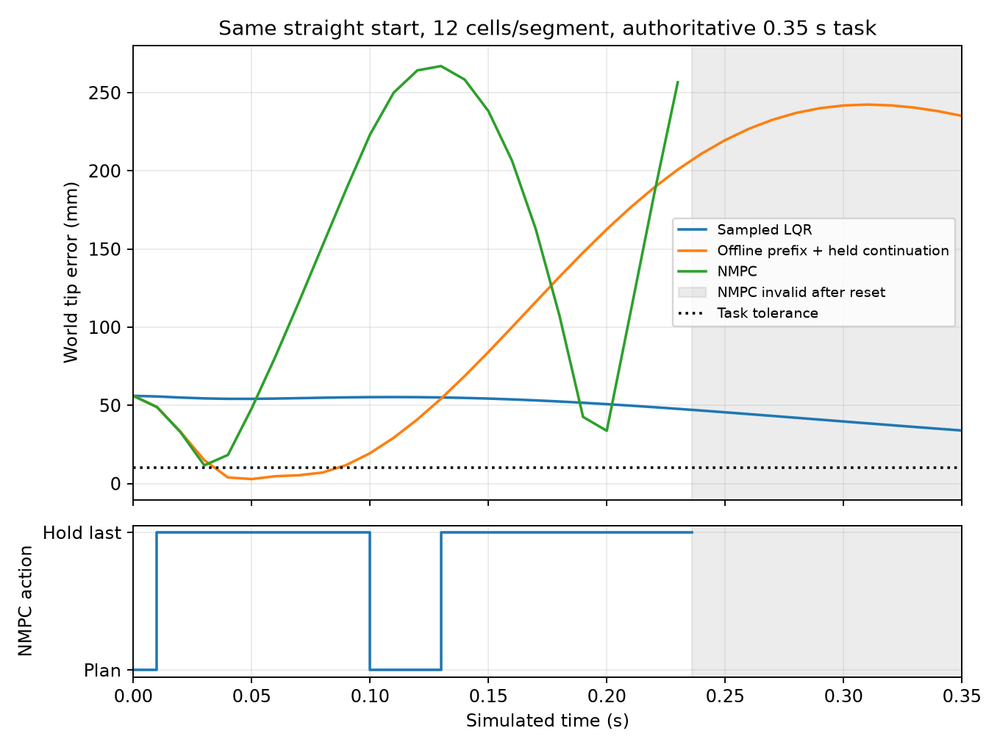

# Stage 3.12 through first GVS NMPC

Physical design and frozen Stage 3.6/3.11 artifacts are unchanged. This report separates implementation, single-state agreement, task performance and computational feasibility.

## Agreement and measured cost

Errors below reuse Stage 3.11; units: tip/shape/COM m, generalized gravity N*m^2/rad, constitutive stiffness N*m^3/rad^2, tendon Jacobian m^2/rad. Parentheses are relative errors. Geometry relatives use world-position norms and are frame-dependent; no composite score is defined. Full per-tendon errors remain linked by EvidenceRef and source location.

| Cells/segment | Tip | Shape RMS | Whole COM | Gravity | Stiffness | Tendon Jacobian |
|---:|---:|---:|---:|---:|---:|---:|
| 3 | 0.0169391 (0.04861) | 0.00756487 (0.03241) | 0.00401828 (0.01909) | 0.00133874 (0.2251) | 0.000440654 (0.1035) | 0.000269728 (0.05066) |
| 6 | 0.00834987 (0.02396) | 0.00356134 (0.01526) | 0.00185894 (0.008833) | 0.000656507 (0.1104) | 0.000141442 (0.03322) | 6.51631e-05 (0.01224) |
| 12 | 0.00413971 (0.01188) | 0.00172558 (0.007393) | 0.000893588 (0.004246) | 0.000325512 (0.05473) | 3.53609e-05 (0.008304) | 3.82382e-05 (0.007181) |
| 24 | 0.0020573 (0.005904) | 0.000847645 (0.003632) | 0.000436623 (0.002075) | 0.000162209 (0.02727) | 8.84025e-06 (0.002076) | 2.0491e-05 (0.003848) |

| Cells | Resolve ms | MJCF ms | Compile ms | Warm forward us | 0.1 s stepping ms | Valid / max contacts |
|---:|---:|---:|---:|---:|---:|---|
| 3 | 4.2991 | 2.2086 | 3.6290 | 5.1230 | 1.2959 | True / 0 |
| 6 | 6.5716 | 3.2918 | 4.7554 | 8.1740 | 2.0014 | True / 0 |
| 12 | 9.8206 | 5.9068 | 7.2665 | 15.6670 | 4.5200 | True / 0 |
| 24 | 18.8863 | 11.9379 | 16.0407 | 46.9850 | 13.9130 | True / 0 |

Three repetitions; ten forward and ten step warm-ups; 100 forward calls and 200 actual steps per batch. Physics timestep 0.5 ms, implicitfast, mapped q0, held u0, native floor enabled, no observed contacts, no rendering. Medians above; raw wall times and machine/software information are in agreement_cost.json.

Machine: Windows-10-10.0.19044-SP0; Intel64 Family 6 Model 151 Stepping 2, GenuineIntel; 20 logical CPUs; Python 3.11.16 | packaged by Anaconda, Inc. | (main, Aug 27 2026, 14:36:16) [MSC v.1942 64 bit (AMD64)]; NumPy 2.4.6; MuJoCo 3.13.0.

12 cells: 4.14 mm measured tip discrepancy, below a 5 mm development allocation within the 10 mm task tolerance. Single-state static allowance, not a dynamic guarantee.

Production mapping integrates each cell basis across structural knots and preserves principal-axis rotations. Reverse projection uses the same cell-average basis; virtual work uses its transpose. The knot-crossing and represented-state round-trip checks pass. Historical midpoint records are not relabeled. Exact basis integration does not make finite-chain SE(3) geometry exact.

ModelAgreementEvidence retains metric vectors, numerical/model/design identity, exact measured state/input/environment, scope, sources and costs. assess_model_uses consumes matching EvidenceRefs through the existing Store. It reports measured_local only for explicitly matched uses and scope, without changing capability status or authorizing dynamic/contact control. Old records retain validation=unavailable.

## Sampled-data LQR and historical interpretation

Saved continuous max real eigenvalue: -3.175607805 /s. Holding the same K for 10 ms gives rho(Ad-Bd K)=24.46305321. New discrete Riccati gain: rho=0.9683849338.

Stage 3.6 L0-L2 recomputed feedback continuously during integration; MuJoCo held input for 10 ms while stepping physics every 0.5 ms. They are different closed-loop systems. The held-input instability is an additional explanation, not an attribution of all historical failure to sampling or spatial discretization. The quoted radius describes the pure, unsaturated saved LQR law near its operating point; optional task feedback is disabled in these new runs.

controller.gvs_sampled_lqr is a separate registry identity. Augmented matrix exponential transports A, B and affine drift without inverting A. Continuous and discrete equilibrium checks precede the equilibrium-centered law. Q/R retain the historical numeric diagonals (q=1, qdot=0.1, tension=1), explicitly interpreted as discrete stage weights, with reciprocal squared state/input units. They are not an exact continuous-cost integral. Commands are updated once per 10 ms and executed as bounded ideal tendon tensions.

| Run | Initial tip mm | Terminal tip mm | Saturated updates | Max projection residual rad/m | Task pass |
|---|---:|---:|---:|---:|---|
| lqr_nominal | 4.1397 | 9.3446 | 0 | 2.2899 | True |
| lqr_perturbation | 3.5503 | 8.9498 | 0 | 2.2772 | True |
| lqr_task | 56.1160 | 33.9417 | 0 | 0.95292 | False |

Nominal projected q drift: 2.42531 rad/m. The 1% perturbation relative to the nominal trajectory shrinks from 0.126736 to 0.0594904 rad/m. Nominal drift is not perturbation recovery. The refined backend develops modes outside the represented GVS subspace. No backend equilibrium adjustment was substituted into the historical operating point.

## Dynamic trajectory and NMPC

The registered optimization_assembler.gvs_trajectory uses the existing OptimizationProblem, trusted CasADi expression transport and IpoptSolver. Physical states are [q,qdot] in resolved order; inputs are physical tensions in frozen tendon order. Internal state decisions are dimensionless, with declared 10 rad/m and 1000 rad/(m*s) scales; saved states and measured-state inputs retain physical units. Initial states are fixed equalities via variable bounds. Implicit Euler uses mass/force balance with declared residual scaling; physical tension bounds come from RobotIR. Tip output is world-frame. The objective combines tolerance-normalized tip tracking and terminal error, velocity, tension effort and input variation. Smoothing is a control penalty, not an actuator law.

The graph and solver are cached. Only the measured initial-state equalities, previous tension and shifted warm start change between updates. Finite iteration-limited candidates remain available as optimization guesses even when they cannot supply a command. A callback retains the best feasible iterate within the current solve and current bounds; independent reevaluation confirms feasibility before use. The raw return status and returned-iterate violation remain recorded. Nominal operating metadata stays separate. A converged or iteration-limited plan is usable only when independently evaluated constraint/bound violation is at most 1e-5. Feasible iteration-limited plans are explicitly suboptimal: their raw solver status remains iteration_limit and they count as nonconverged solver failures. They do not count as hold-last fallback. When no usable plan is returned, the sole failure response is hold-last-bounded-tension (clipped nominal tension initially), with every use recorded. The same 10 ms command period, 0.5 ms MuJoCo physics step and authoritative 0.35 s task duration are retained.

One 10 ms prediction check against scipy BDF exact AD Jacobian, rtol=1e-7 atol=1e-8: tip discrepancy 0.000387627 m, q norm error 0.198563, rate norm error 29.0233. This verifies only the recorded interval.

Offline IPOPT: iteration_limit, independently evaluated maximum scaled constraint/bound violation 3.55707e-07, objective 0.362275, total call time 144.4033 s; graph assembly 0.4006 s; solver construction 19.5740 s; optimization 124.6466 s. Full states, tensions and world outputs are saved.

The offline OCP optimizes 5 intervals (0.050 s), the same prediction horizon used by NMPC. The full-duration open-loop experiment executes 35 intervals (0.350 s), holding the last optimized tension after the prefix. The continuation is not an optimized trajectory, and the short-horizon endpoint is not reported as task success. Both replays and the authoritative evaluator retain the original 0.35 s duration.

Independent nonlinear GVS replay: terminal error 255.61 mm; elapsed 136.4979 s.

MuJoCo held-input replay: terminal error 235.15 mm; elapsed 0.2173 s.

Public-path NMPC: NUMERICAL FAILURE at 0.236 s; no valid terminal error or full-task pass. Raw post-reset endpoint error 374.56 mm is not task evidence; 34 nonconverged/failed solves, 3 feasible suboptimal updates, 31 hold-last fallback uses; 35 deadline misses. These counts cover the full diagnostic execution. Mean / maximum solve time 125.1943 / 126.5150 s. Full execution wall time 4409.6250 s. It is not real-time control.

MuJoCo reset the state during the interval [0.23, 0.24]. The running backend checked BADQACC only and continued after BADQVEL. Post-reset observations are diagnostic only, not a valid task trajectory.

Backend now checks BADQPOS/BADQVEL/BADQACC, nonfinite states and time reset after every physics step. A focused real-engine velocity-reset test passes. No new full-task solve is performed.

The raw public simulation result and evaluation rejection receipt are preserved. Public evaluation correctly rejected DEPENDENCIES_CHANGED because the backend guard was fixed while the process ran; no session snapshot was changed to bypass that check. Read-only finalization invokes the unchanged registered evaluate.reach function on the saved result. nmpc_numerically_reviewed_result.json marks a separate derived BackendResult failed; that same authoritative evaluator returns validity=incomplete, task_success=null, reason=SOLVER_NOT_COMPLETE. This is failure to deliver a valid task trajectory, not a task pass. Reproduction with the corrected backend stops at the first detected numerical failure rather than continuing after a reset.

| Same straight start, 0.35 s task | Minimum / terminal error mm | Actual tension range N | Maximum projection residual rad/m | Task pass |
|---|---:|---:|---:|---|
| Sampled LQR | 33.9417 / 33.9417 | 0.38688 to 5.028 | 0.95292 | False |
| Offline sequence in MuJoCo | 2.8813 / 235.1536 | 1.3957e-05 to 7.9762 | 7.1333 | False |
| NMPC in MuJoCo | 11.6377 / invalid after reset | 1.2017e-09 to 8 | 9.0101 | incomplete |

Execution check: 35 NMPC updates, 700 physics steps; straight initial state confirmed=True. Offline initial equality error 0; held-tension replay difference 0 N. Maximum optimized-prefix prediction-to-BDF tip discrepancy 4.7909 mm.

The update/step totals include the invalid post-reset continuation and do not certify 0.35 s of valid physical integration.

Before the numerical failure: 24 control updates, 20 hold-last uses, 3 feasible suboptimal plans and 1 converged plans. Last valid sampled tip error: 256.63 mm. Later updates are post-reset diagnostics only.

Solve statuses: {'iteration_limit': 34, 'converged': 1}. Usable commands: 4; converged updates: 1; selected earlier feasible iterates: 3. Maximum violation among usable plans: 5.510547712583858e-07; maximum raw returned violation: 0.5227751737772978. Total solver construction time across updates: 19.8016 s.

| Trace transient (NMPC truncated at numerical failure) | First sampled entry within 10 mm, s | Peak error mm | Terminal tip speed, m/s |
|---|---:|---:|---:|
| lqr_task | never | 56.116 | 0.1127867605940773 |
| offline_backend_replay | 0.04 | 242.37 | 0.5268577912352266 |
| nmpc_task | never | 267.01 | unavailable |

Tip speed is a finite difference over the final observation interval. First entry into tolerance is not a settling or stability claim.



Optimization software: CasADi 3.7.2, SciPy 1.17.1; 1 stage-evaluation threads. The trusted expression wrapper is inlined for differentiation; each implicit stage retains a local derivative boundary. Solver construction and per-update solve times are recorded separately.

An earlier 35-interval solve was interrupted after more than 50 minutes without a returned result. The expensive combined objective/constraint derivative boundary was then corrected. That interrupted attempt supplies no trajectory, feasibility or task-success evidence.

The later full-horizon attempt also returned no trajectory within 1954.1 s and was stopped. The first offline problem was therefore reduced to the configured NMPC horizon, while retaining the original task duration for all backend evaluations. Interrupted attempts, including the intermediate thread-configuration attempt, are retained as unsuccessful computation records.

The final configuration uses a 50 ms horizon, at most 40 IPOPT iterations and a 120 s CPU limit per solve. Reproduction reuses the archived offline_scaled_candidate.json as a numerical initial guess, then performs new offline and closed-loop solves. The interrupted cold starts are not required. Four cancelled public debugging runs and their completed cancellation receipts are retained separately; they supply no full-task success evidence. The final run uses the last backend allocation of the original project grant.

## Reproduction

From D:\softrobot-agent, using the resolved interpreter:

```powershell
Set-Location 'D:\softrobot-agent'
$py = 'C:\Users\gugugaga\miniconda3\envs\softagent\python.exe'
$env:OPENBLAS_NUM_THREADS = '1'
$env:OMP_NUM_THREADS = '1'
$env:MKL_NUM_THREADS = '1'
$out = 'runs/stage312_nmpc_reproduction' # choose a fresh directory
& $py runs/stage312_to_nmpc_20260926/agreement_cost.py --output $out
& $py runs/stage312_to_nmpc_20260926/experiment.py baseline --output $out
& $py runs/stage312_to_nmpc_20260926/experiment.py dynamic --output $out
& $py runs/stage312_to_nmpc_20260926/experiment.py finalize --output $out
& $py runs/stage312_to_nmpc_20260926/report.py --output $out
```

Public execution receipts and per-run backend folders contain the authoritative evaluator evidence. Existing run IDs are immutable; reproduction uses a fresh evidence directory. No paid LLM calls, pushes or merges are part of this experiment.

## Focused validation and limits

Eight sampled-math/applicability checks pass, plus the existing generic IPOPT check extended to confirm changed fixed initial bounds use a cached solver. A focused real IPOPT parabola test also verifies that an infeasible final iterate does not displace an earlier feasible candidate, while iteration_limit remains the solve status. One real MuJoCo step test reproduces a huge-velocity reset to finite values and verifies the corrected numerical-failure guard. The actual backend executions are the end-to-end evidence. The small-angle value/Jacobian check uses an independent matrix exponential. No full suite or gain/resolution sweep was run.

Agreement covers one fixed state, basis, design and numerical configuration. Local LQR tip success does not establish exact regulation or global stability. GVS omits out-of-subspace backend modes and the first dynamic integrator check covers one interval. Task success, NLP feasibility and real-time feasibility are separate claims. CPU-bounded solves are timing-dependent: reproduction preserves the protocol and archived seed, not bit-identical termination iterates.

Current graph check: Christoffel bias finite-difference maximum error 5.45138e-17; A/B maximum differences from saved matrices 1.34644e-05 / 4.6764e-07 (rtol=1e-8, atol=1e-5). Graph construction 1.1649 s; full dynamics call 0.0377 s; derivative construction plus first call 9.0441 s.

Stable small-angle evaluation changes the saved point's numerical acceleration residual. The separately saved precision-refinement artifact moves q by 2.07429e-12 rad/m and reduces the residual to 1.28921e-08. Reproduction uses this derived point for sampled synthesis, while preserving frozen historical matrices and initial states. The archived local/backend results were obtained before this numerical-only refinement.

The subsequent [checkout verification](CHECKOUT_REVIEW.md) reproduces the saved-matrix radii without a new simulation and records the task-environment evidence-matching correction and its focused regression check.
